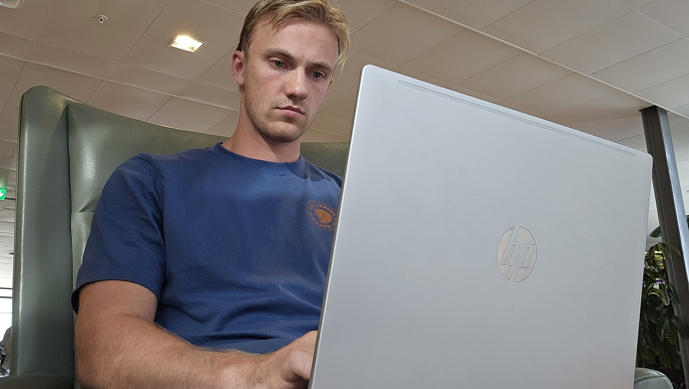
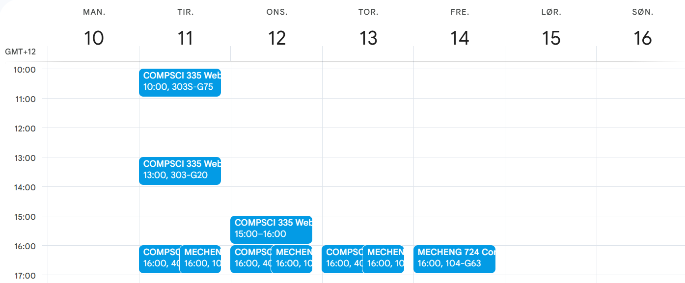
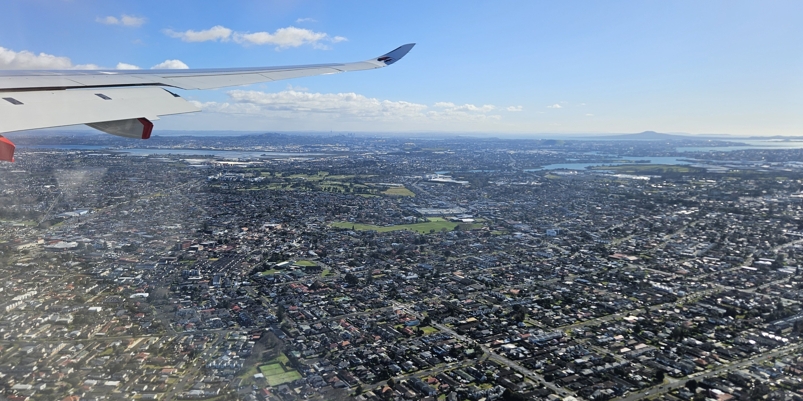

# Reisen til New Zealand

Dagen(e) hvor jeg skal reise til New Zealand har endelig kommet, og mitt første blogginnlegg dedikeres selvsagt til det.

Formatet er helt nytt for meg, så dere må tilgi eventuelle stilistiske feiltrinn eller andre grove brudd på blogg-konvensjoner.

## Gardermoen

Dagen startet, overraskende nok på Gardermoen, heldigvis fullstendig begivenhetsløst. I min frykt for å ikke rekke flyet (det hadde vært en kolossal tabbe) spaserte jeg av flytoget 1615, to og en halv time før avgang. Etter å ha sneket meg gjennom sikkerhetskontrollen hadde jeg to gode timer å slå i hjel, og jeg var dermed strålende fornøyd med beslutningen om å møte opp særdeles tidlig. 

Men det var ikke til ingen nytte, siden jeg fikk solo-scrummet litt, og utbedret bloggen **betraktelig**. For eksempel gadd jeg endelig gjøre den mega-artige oppgaven å migrere feedback-databasen fra local til remote. Det betyr at det nå endelig er mulig å sende oss anonyme hatmeldinger ved å trykke på en av knappene nede til høyre. Det gleder i hvert fall jeg meg til å lese.

## Fly Oslo - Istanbul

Fra flyvningne med de ordinære plastflyene til SAS og Norwegian har jeg blitt vant til en ganske spartansk standard. Du sitter i et plastsete, stirrer på plastsetet foran deg, får servert en kopp med helt grei te, og lander etter maks to timer. På dette Turkish Airlines-flyet var det en litt annen standard. Plastsetene besto, men plastbaksiden av plaststolen foran var byttet ut med en skjerm med spill og film og musikk. Det var gledelig å se at de hadde litt norsk musikk i musikkatalogen også, for eksempel Lemaitre sitt album *Chapter One*, som er meget bra og definitivt anbefalt. Koppen med te var byttet ut med et tre-retters måltid som besto av en forrett med noe rotgrønnsaker, en hovedrett med pasta i en slags kremet tomatsaus og sjokolademousse til dessert. Middagen var god, men jeg rørte ikke musikken, til tross for utleverte ørepropper. I stedet tok jeg flyturen som en ekte mann uten lademulighet og frykt for å gå tom for strøm på mobilen. Splite 2048 og Angry Birds på skjermen, og skrev på dette innlegget.

## Istanbul

To timer layover. Rakk så vidt gå gjennom sikkerhetskontrollen (trodde ikke man trengte gjøre det på nytt, men greit), fylle flasken og finne gaten før boarding startet. 

## Fly Istanbul - Kuala Lumpur

Klokken er 0100 (ish) Norge-tid, 1100 (ish) Auckland-tid. Best å legge seg. Natta bloggen

Da jeg våknet satt mannen ved siden av meg og spilte 2048. Ikke for å disse ham ellernoe, men han var skikkelig dårlig. Sveipet høyre og venstre og opp og ned om hverandre. Det er jo helt håpløst. Føler 2048 skal være en sånn First Price-versjon av Subway Surfers, men dette var rett og slett ikke noe gøy å se på. I stedet fyrte jeg opp litt rugby på skjermen, og fikk endelig se opphavet til det smidige ordet *scrum*. Og jeg kan si her og nå at det ligner INGENTING på det vi lærte på universitetet. Ble ikke noe klokere på extreme programming, product owner eller kanban-board heller. Her har tydeligvis rubgy en vei å gå når det gjelder sin pedagogiske innretning.

Touchdown etter ti timer på flyet, og da var det deilig å vite at jeg endelig var halvveis på reisen.

## Kuala Lumpur

Her hadde jeg en fire timer lang overgang, og gaten ble ikke bekreftet før ganske sent. Men da jeg landet var jeg ganske stresset for at gaten kanskje var borte, så *naturligvis* gikk jeg en runde og sjekket at absolutt alle gatene var der. Fjoh. Det var de. Da er reisen trygg.

Jeg brukte deler av resten av tiden til å endelig finne ut av hvor og når jeg ikke skal dra i forelesning:

## Fly Kuala Lumpur - Auckland

Nok en ti timer lang flytur, men denne gangen ventet slutten på reisen i andre enden. Jeg kan avsløre at dette flyet med Malaysia Airlines også var bedre enn flyene til SAS og Norwegian. Det var sammenlignbart med Turkish Airlines, bortsett fra at spillene på skjermen var mye dårligere. Ikke noe Angry Birds eller 20248, ikke engang Temple Run som et plaster på såret. Det hadde ikke vært *så* mye å be om.

Her er utsikten fra flyet ved innflyvning til Auckland. Om dere ser veldig nøye på horisonten under flyvingen er det noen høye bygninger/tårn. De er i bysentrum, som vil si omtrent der jeg bor. Det i forgrunnen gjetter jeg er en slags Aucklands variant av Lillestrøm eller Jessheim. 

## Auckland

Nå har jeg offisielt satt ny rekord i å være lengst unna hjemme. Da jeg kom frem var det friske 9 grader og strålende sol. Greide å kjøpe både mobilabonnement og adapter til mobilladeren, så nå kan jeg reelse mens jeg går til Universitet uten bekymring. Det betyr også at jeg ikke er mulig å nå via SMS eller ringing. Prøv heller Whatsapp eller Signal eller Messenger. Eller snapchat hvis det virkelig kniper.

I skrivende stund er klokken 0646 Norge-tid. Det er godt over 36 timer siden jeg reiste hjemmefra. Jeg har fått innlosjert meg selv i mitt nye hjem på Moholt studentby, eller Te Tirohanga, som de har valgt å kalle det her borte. Jeg er sliten. Jeg blogger mer senere

Ses senere, bloggen