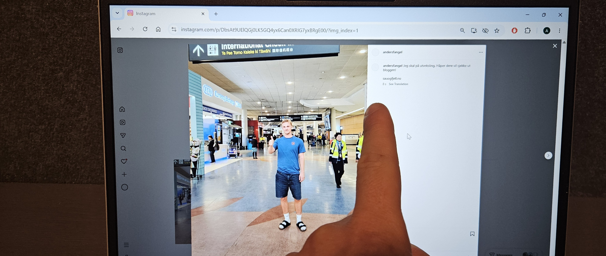

# Gjorde noe belastende

I dag la jeg ut noe på Instagram. Det har jeg ikke gjort på mange år, og det med god grunn, siden det var meget belastende. Det betyr at jeg har tilsmusset mitt gode rykte som en person med lavt sosialemedieravtrykk, bare i et lite håp om at det får flere til å lese denne bloggen.

I skrivende stund er det omtrent 8 sekunder siden jeg publiserte innlegget, og jeg har til nå fått 0 likerklikk. Lurer kanskje på om alle vennene mine er falske???

