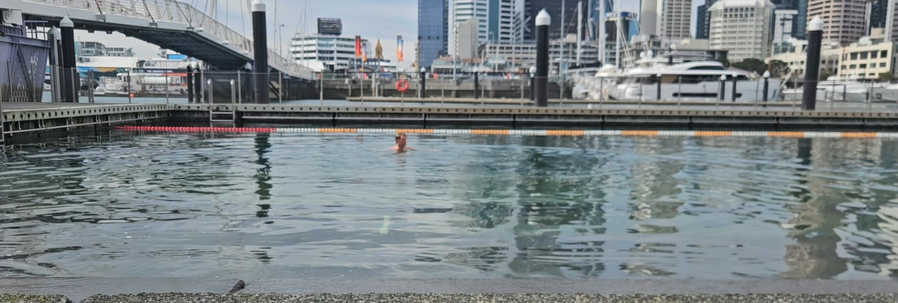
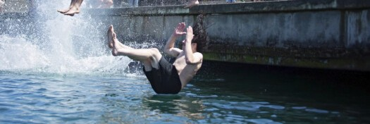

# First swim in New Zealand

Today I took my first swim in New Zealand. This marks 154 weeks in a row, so the three year anniversary is fast approaching. Before I came here I was a bit worried it would be difficult to get the weekly dip, but when the Auckland City Council are so nice, and build stairs into the water right by the docks, it's no problem at all.

 

Afterwards I found out that the place I swam is the place they hold the final of the cannonball world championship. The cannonball is called "manu" over here, and is apparently quite a big thing. The technique is to fold the body into a clear V, and land with the bottom first into the water. Then you will get a huuuge splash, and the bigger the splash you make, the cooler of a guy you are. That New Zealand has their own version of dødsing, where you land the opposite way, doesn't exactly weaken the hypothesis that New Zealand is Norway upside down.

Exact dates for qualification and final in 2027 has not been announced yet, but the final will be in March, with qualification in the months before. One thing that I can announce here and now though, is that I with a 100 % chance will watch the final live and in person. And if I'm very motivated, I may even sign up for the qualification. Is that something the blog wants? I am susceptible to pressure.

[Manu world champs sin nettside](https://manuworldchamps.com/)