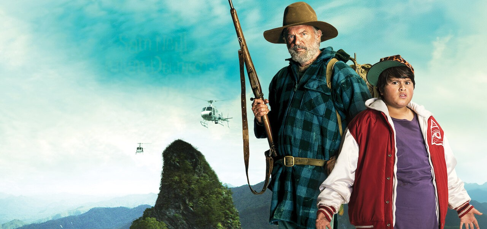
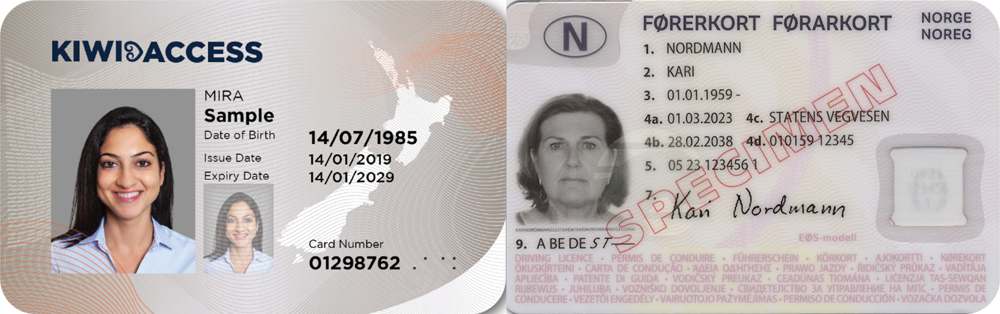
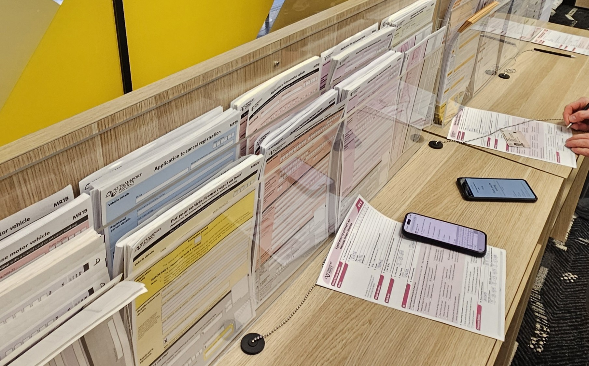

# Min første kamp mot byråkratiet

I går så jeg en New Zealandsk film som heter *Hunt for the Wilderpeople*, regissert av Taika Waititi. Den handler om en ung gutt som har gått fra fosterhjem til fosterhjem og til slutt blir plassert på en gård i den New Zealandske villmarken. Jeg likte filmen veldig godt; den var både morsom og spennende, så den anbefales varmt. I denne filmen møtte vi også en karakter som hadde flyttet vekk fra samfunnet og ut i skogen. Han sa at myndighetene tvang deg til å fylle ut altfor mange skjemaer, og at han var lei av det. Og hvis du vil slutte å fylle ut skjemaer? Da må du fylle ut sånn fire nye skjemaer bare for å få lov til det. Haha, gøy med den gærne mannen som sier at myndighetene tvinger deg til å fylle ut skjemaer. 

Den eneste gyldige legitimasjonen vi som norske borgere har i New Zealand er norsk pass, som betyr at vi må ha med oss pass når vi skal inn på utesteder eller kjøpe øl i butikken. Hvis du ikke vil risikere å miste passet ditt på byen kan du skaffe deg enten [Kiwi Access Card](https://kiwiaccess.co.nz/) eller New Zealandsk førerkort, som begge er gyldig legitimasjon. Norsk førerkort er ikke godkjent. Hvordan Legoland-IDen til venstre er god nok, mens EØS-førerkortet til høyre ikke duger, er et mysterium for meg, men sånn er det visst her.

I dag dro jeg til mitt lokale New Zealand Automobile Association-kontor for å konverte det norske førerkortet til et New Zealandsk førerkort. Siden Norge er på en slags snill gutt-liste, er det ikke nødvendig med førerprøve eller noe sånt, så det er jo ganske beleilig. Det koster noen hundrelapper, men det føler jeg er verdt det. Dermed møtte jeg håpefullt opp på kontoret med pass, norsk førerkort og internasjonalt førerkort. Internasjonalt førerkort utstedes bl.a. av NAF, og er gyldig som førerkort i omtrent hele verden, inkludert New Zealand. For å få internasjonalt førerkort må man fylle ut et skjema på nett, og laste opp bilde av seg selv og førerkortet sitt. Det er altså ikke mulig å jukse seg til et sånt internasjonalt førerkort. 

På trafikkstasjonen er det første du møter en vegg av skjemaer, for hver neste tenkelige case du kan komme til en trafikkstasjon med. Akkurat som mannen sa...

Jaja, får fylle ut det skjemaet da, så skal jeg få meg New Zealandsk førerkort. Fyller ut skjemaet. Møter opp i skranken. Det internasjonale førerkortet er ikke en gyldig oversettelse av førerkortet ditt. Men det er et gyldig førerkort i New Zealand. Ja, men det er ikke en gyldig oversettelse. Men det står jo på engelsk. Det er feil engelsk. Du må ha en oversettelse fra en oversetter godkjent av *staten*. Jaha. Du må inn på denne nettsiden og finne en. Og så må du fylle ut skjemaet deres. Og så må du vente på svar. Og så må du printe ut oversettelsen og ta med til oss. Så skal vi vurdere saken din.

Jeg har altså *ikke* fått New Zealandsk førerkort, og må fremdeles bruke pass som legitimasjon.

