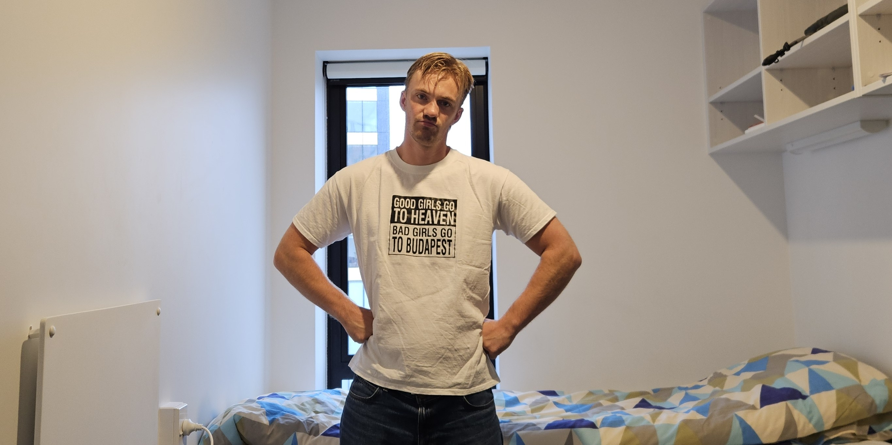
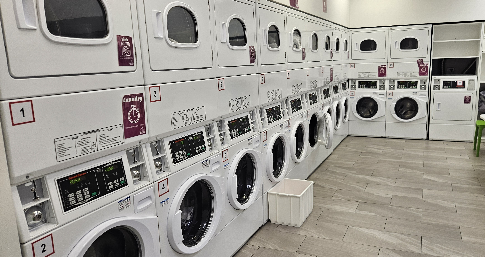

# No clean clothes

Critical situation today. I only had one clean t-shirt left. And I am not going to put on a dirty one. Hence I am wearing this t-shirt today. Hope the kiwis think I look cool while wearing it. 

It is actually not that bad cleaning here, the cleaning room(?) is nice and everything. It is only laziness, and a choose to blame myself.

**Update:** A dutchman said I had a nice t-shirt. And then another dutchman said I had a cool t-shirt. Very good day. 