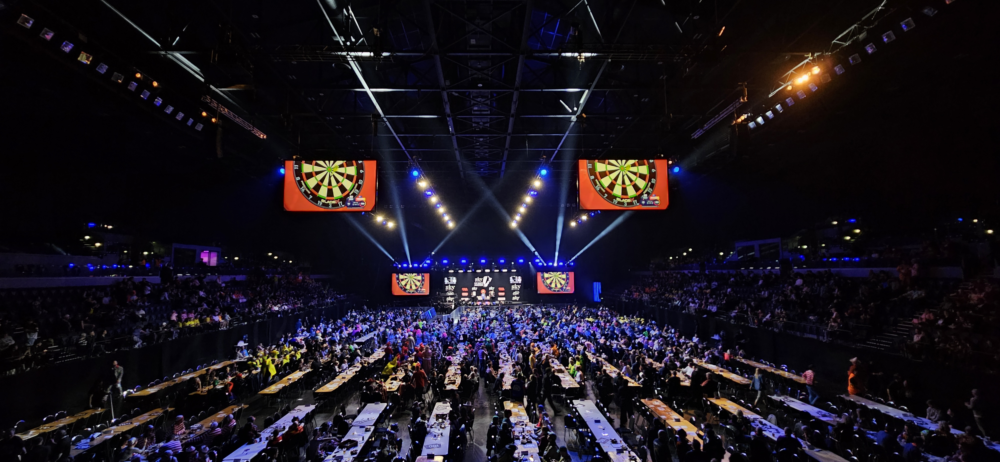
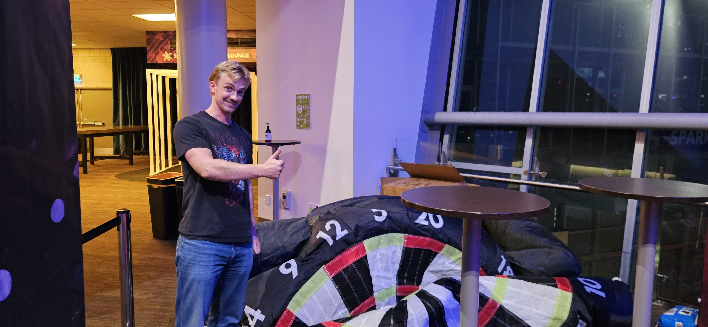

# Watched Darts live

Today was the first day of *New Zealand Darts Masters*. Some nice swedes asked if we wanted to go to the arena to watch, which we obviously wanted. Earlier, I have watched some darts through stumbling over it on Eurosport 3, but not this time. This time I was a deliberate viewer. And it was fun! Every time they hit a 180 eight there were big cheers in the arena and a commentator that said "WWWOOOOOOONN EJJJTIH", which apparently means "one hundred and eighty". I was sadly too busy cheering to take a picture of the arena during a 180, but below is a picture of the arena at a calmer moment.

The highest highlight of the did not happen inside the arena, but right outside the entrance. There, they had placed a huuuge dartboard with velcro, and then you could stand in line to throw three balls, also with velcro, at the board. There was of course a participation trophy, shaped as a bag og some weird candies, but also a main prize if you hit the bullseye on your third throw. It was simply to show up and collect that main prize obviously. I won a case to store my six favorite darts, which I am going to use all the time. They also wrote my name on a liste where I was part of a raffle to win two nights at a hotel. The odds are good; I was only the fifth person to hit the bullseye when they wrote me down. So fingers are crossed. I forgot to take a picture right after the victory, but got a picture with the deflated dart board after they started taking it down. Splendid.

