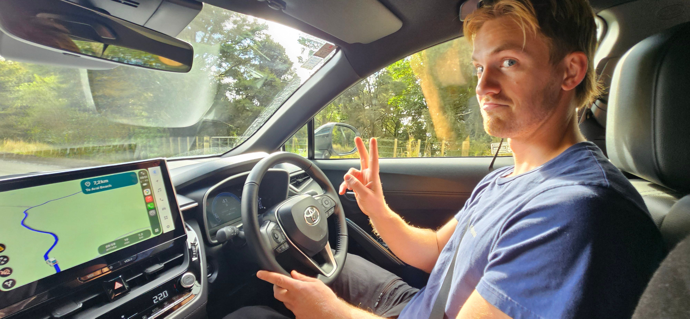
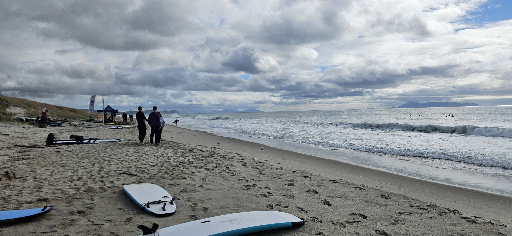
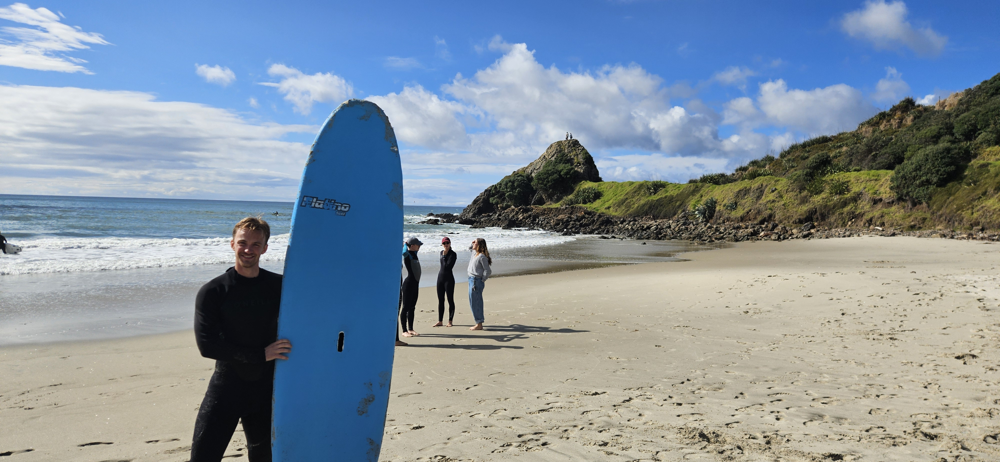

# Prøvde å surfe i dag

Dette er mitt første reisebrev, siden jeg for første gang dro på en reisebrev-verdig reise, til tross for at det kun var en dagstur. Tidligere reiser har inkludert busstur til en sportsbutikk og spasertur til matbutikken, noe jeg anser som ganske kjedelig. 

I dag reiste jeg til Te Arai med en haug andre studenter som alle er med i University of Auckland sin surfeklubb for å surfe! Dagen startet 0800 hos leiebilforhandleren der vi fikk hentet ut vår flotte Toyota Corolla Cross Hybrid. Den hadde rattet på feil side, og skulle tydeligvis kjøres på feil side av veien også. Det ble en prøvelse, men gikk heldigvis fint. 

Vel fremme ved stranden. Bil, sjåfør og passasjerer i god behold. Stranden var veldig lang og fin! (Se bilde). Dessuten var vi heldig med været! Deilige 15 grader og tidvis sol. Og det på den tiden av året som skal være mest vinter

Så var det det å surfe da. Det er tydeligvis ikke så lett, så dagen i dag var utvilsomt dagen jeg *prøvde* å surfe for første gang. Mot slutten av dagen greide jeg å ta en bølge, til min store glede. Og så falt jeg av. Da var jeg både sliten og fornøyd. Jeg prøvde noen runder til, men tanken var tom. Rating: 10/10. ommer til å gjøre det igjen, og da skal jeg få det til!

