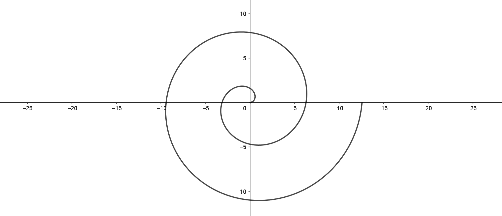
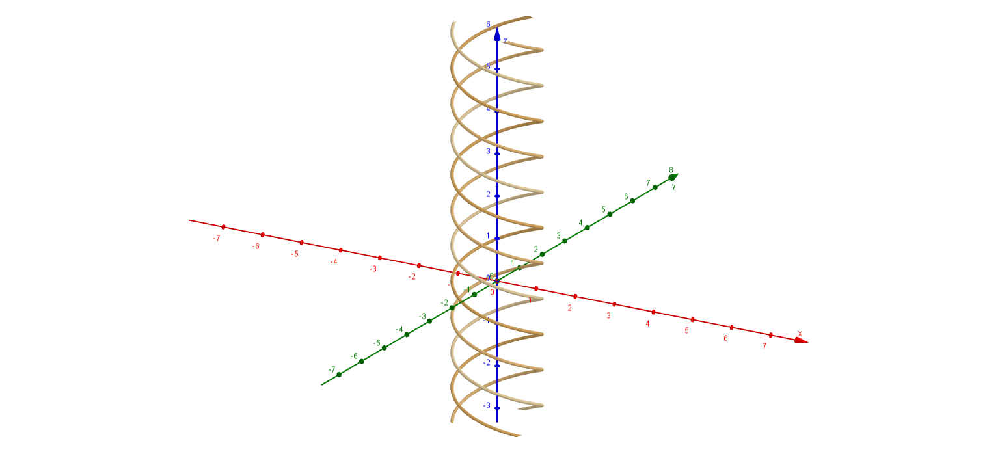
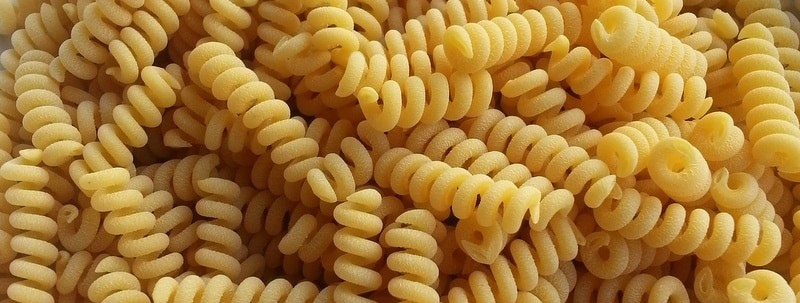

# American conditions in the pasta shelf

I do not know how the pasta shelf looks in an American grocery store, but based on my prejudice against that country I assume it looks something like this.

I doubt it is any different in England, but I had hoped New Zealand wouldn't sink so low that they had to call Fusilli for SPIRALS. It is a terrible name. Firstly, it is not a spiral. A spiral is defined as $x=r(\theta)\cos(\theta),\ y=r(\theta)\sin(\theta)$ and looks like this:

Please note that this is a **two-dimensional** shape. I can't see a third coordinate at least. So which part of a fusilli that is a 2D is a mystery to me. Oh right, the cross-section. But that's not a spiral either!!!

I can *maybe* (MAYBE) accept that the fusilli is a helix, but that isn't what it says on the packaging either, is it?? 

There even exists a pasta which is a helix, which you in the *worst* case could call pasta spirals. It is called *Fusilli Bucati Corti*, but for a country which so obviously remembers nothing of their European heritage, this sounds very difficult.

Just call the fusilli for screws, it is actually that easy.

<!-- https://www.delallo.com/blog/pasta-shapes?srsltid=AfmBOopn5FIVzhkpHiv3Hv7GQA7b2ZQxxy30JL16DESLrnP2Hgo1ZpGT

Heliks i geogebra
Curve(sin(t), cos(t), t / s, t, 0, 10)
Curve(sin(t + 2π / 3), cos(t + 2π / 3), t / 2, t, 0, 10)
Curve(sin(t + 4π / 3), cos(t + 4π / 3), t / 2, t, 0, 10)
Denne kan gjøres med en liste også, sånn at det blir dynamisk hvor mange skruer

Spiral
Curve((θ; θ), θ, 0, 4π)
ekvivalent: Curve(cos(θ) θ, sin(θ) θ, θ, 0, 4π)

Curve((θ; θ + 2π / 3), θ, 0, 4π)
Curve((θ; θ + 4π / 3), θ, 0, 4π)

Faseskift:
ϕ=First(Sequence(0, 2π, 2π / n), n) -->