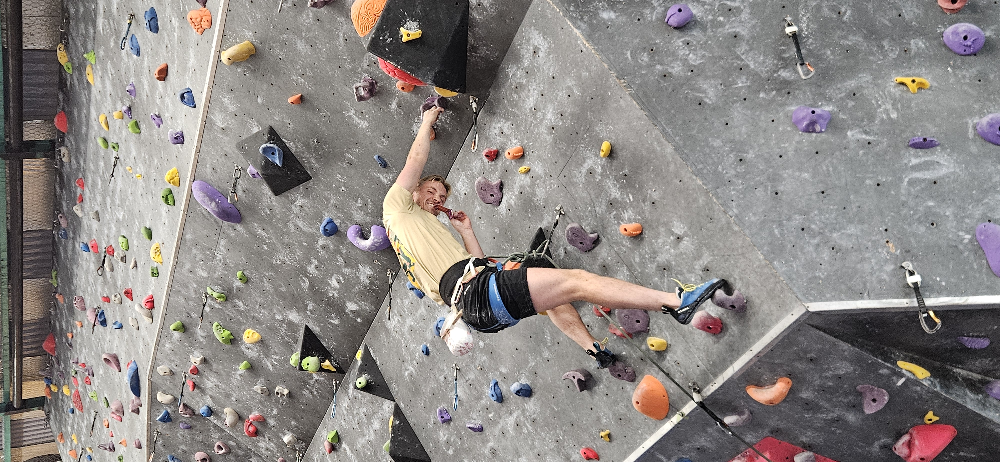

# Besto klatreprøven

New Zealand elsker regler. Men ikke noen andre sine. Så for å få lov til å klatre og sikre led her er det ikke godt nok med norsk brattkort. I stedet må en av de ansatte på klatresenteret se på deg klatre og sikre led, for å godkjenne at du kan gjøre det på den spesifikke gymmen. Om du vil klatre på en annen gym må du værsågod ta testen der også.

Forrige uke prøvde jeg å ta testen, men den 16 år gamle eksaminatoren sa bare "You don't know how to use the grigri". Og jeg bare "I know, it's the first time I've used one". Og han bare "I cannot pass you, you don't know how to use it". Og jeg bare "Isn't the point to keep the climber from dying. This was always safer than the ATC". Og han bare "You don't know how to use it. You must practice more". Og jeg bare "How am I supposed to practice if I am not allowed to belay". Og han bare "You can try again next time". Og jeg bare likte ikke å stryke sikretesten.

Men denne uken besto jeg! Så nå er jeg Certified Lead Climber i Birkenhead Pool and Leisure Center, LinkedIn-innlegg kommer snart. 

