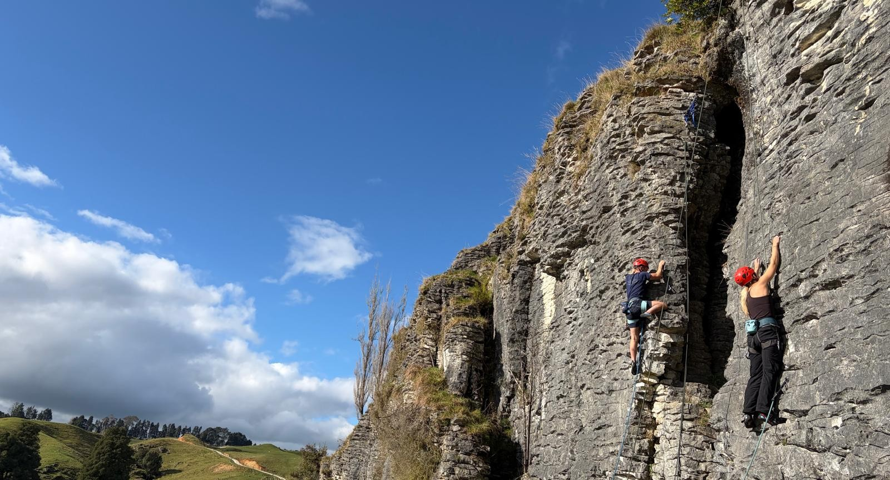

# Climbed outside

Prepare yourselves for that I will spend all my vacations and weekends on climbing trips. And I will obviously talk about it A LOT. Everytime it is appropriate, eventually isn't appropriate, I will make sure to explicitly rub it in that I am a much better person than you who spends my spare time climbing outdoors.

Look at this picture of me climbing lead *all* alone. It was actually a bit scary. But luckily also fun, so there will probbably be more of this. I hope the blog thinks that is okay, as I will not ask for permission. I take no criticism on my technique, I'm working on it okay