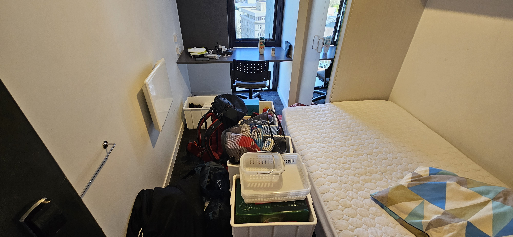

# Kvelder som dette

**Lørdag 23:45**
Jeg har vært våken siden klokken seks og har nettopp kommet hjem fra en lang dag ute. Nå er jeg veldig klar for å ta en dusj og legge meg i sengen. Jeg finner frem nøkkelkortet, piper det på dørlåsen, dytter ned dørhåndtaket. Det rikker seg ikke. Jeg prøver igjen. Bom fast. Jeg venter litt og prøver igjen. Ingen bevegelse. 

**Søndag 00:37**

Har snakket med damen i resepsjonen. Det er heldigvis døgnbemanning. Hun prøver å få en reperatørmann til å komme hit for å fikse låsen. Det er ikke så lett. Men det skal komme en snart, det er hun sikker på. Kveldens første seng; det er jo tross alt ikke så lenge til jeg kommer inn på rommet igjen.

**Søndag 01:12**

Kan virke som reperatørmannen lar vente på seg. Jeg får ikke sove i resepsjonen uansett. Så jeg spør pent om jeg kan legge meg et annet sted, og blir foreslått å legge med i "Karaoke room". Det er vanligvis ikke lov, men hun skal gjøre et unntak bare for meg. Så snill. Kveldens andre seng. 

**Søndag 01:47**

Jeg har akkurat greid å få en halvtime med kvalitetshvile når jeg blir vekket av en mann jeg aldri har sett før. Det kommer ingen reperatørmann, men det skal komme en i morgen og fikse låsen min så jeg får rommet tilbake. I mellomtiden har de funnet et ledig rom til meg, som jeg skal få lov til å sove på i natt. Kveldens tredje seng. Elendig komfort, fjærmadrass. Merk at jeg ikke planla for dette og har dermed ikke med meg rent skift, tannbørste eller mobillader. Ganske ideelt, om jeg skal si det selv. Lader får jeg i det minste lånt i resepsjonen da.

**Søndag 10:31**

Jeg sitter og spiser frokost når jeg får en telefon fra daghavene(?) på studenthybelhotellkomplekset(?). Hvertfall en kis med litt ansvar. Nå har reperatørmannen vært her, men han får ikke fikset låsen. Heldigvis! har han greid å åpne døren slik at den alltid er åpen. Det betyr at du kan flytte alle tingene dine fra rommet med behagelig seng til rommet med ubehagelig seng. Og der skal du bo på ubestemt tid.

Som dere kanskje skjønner er jeg veldig fornøyd med hvordan denne kvelden, natten og morgenen har gått.

Resten av dagen gikk forøvrig til å kjøre til Piha og på på tur. Veldig fint. 

