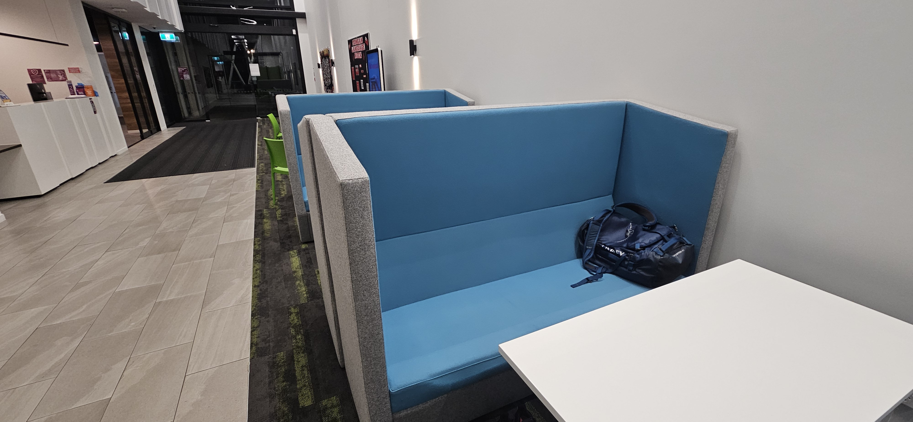
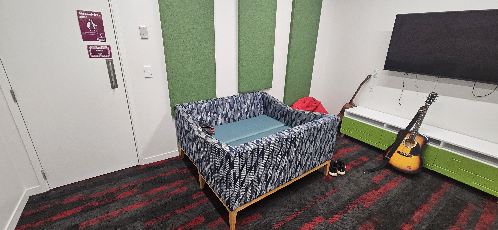
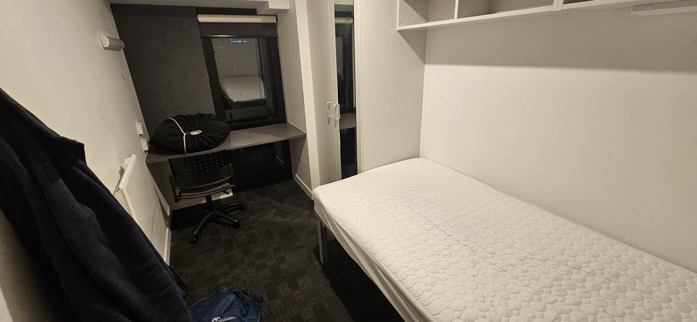
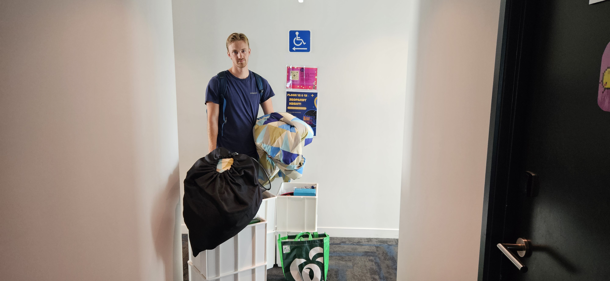

# Locked out

**Saturday 23:45**

I have been up since six in the morning and have just gotten home from a long day outside. Now I am very ready to take a shower and go to bed. Jeg produce my key card, beep the door lock, push down the doorhandle. Which does not move. I try again. Stuck. I wait a litte and try again. No.

**Sunday 00:37**

Now I have spoken with the lady in the reception and explained the situation. Luckily, the reception is manned 24/7. She tried tries to get a repairman to come to fix the lock, but it apprently not that easy. But one will come soon, that she is sure of. I establish myself in the night's first bed; after all it isn't long before I can get into my room again.

**Sunday 01:12**

It seems the repairman is slow to arrive. I can't sleep in the reception anyways, so I kindly ask if I can sleep somewhere else. The receptionist proposes the "Karaoke room". It is usually not permissible, but she will make an exception just for me. How nice. Here is the second bed of the night. 

**Sunday 01:47**

I have just gotten half an hour of quality rest when I am woken by a man I have never seen before. He introduces himself as the "night manager" og tells me with a heavy heart that no repairman is coming. But one will come tomorrow and fix the lock, so I can get my room back. In the meantime they have found a vacant room for me, which I can sleep in tonight. I am ready for my third bed. Terrible comfort. Spring mattress. Paper sheets. Note that I did not plan for this, so I do not have clean clothes, a toothbrush or charger. Quite ideal, if I can say so myself. At least I can borrow a charger in the reception.

**Sunday 10:31**

I sit and eat break when I get a call from the on-duty resident adviser in the studenthallshotelscomplex. Now the repairman has been here, but he can't fix the lock. What he has managet to do though, is deactivate the lock completely, so the door is always open. That means I can go into the room with a comfortable bed, collect all my things, and move them to the room with the uncomfortable bed. And there I will live until further notice. 

As you may understand, I am very happy with how this evening, night and morning has gone. 

The rest of the went to driving to Piha and going on a hike.

