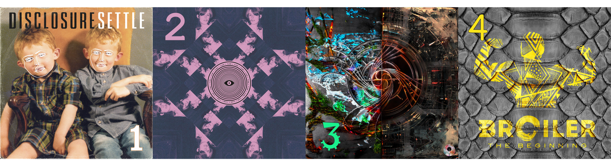

# Verifiserte anbefalinger

Jeg beklager til alle som leste det aller første innlegget mitt og hørte på *Chapter One* av Lemaitre og ikke syntes det var så bra. Jeg hørte på det i dag og jeg syntes ikke det var så bra jeg heller. Derfor har jeg laget en liste med noen album med elektronisk musikk jeg faktisk kan stå inne for.

1. ***Settle* av Disclosure:** Meget bra strandtekno. Noen kaller det også deep house. Jeg anbefaler å styre unna *Special Edition* ettersom det er tre timer langt. Velg heller *Deluxe Version*, den er bare 80 minutter.
2. ***Flume* av Flume:** Se for deg det nye han har laget, men i stedet for at mye er bra og noe er rart, så er det meste bra.
3. ***Fibonacci* av Subtronics:** Musikk som sier 🐭🚨🐭🚨🐭🚨. Jeg skal se han her i Brisbane 12. desember om noen vil være med
4. ***The Beginning* av Broiler:** Dj Broilers første sanger. Også Dj Broilers beste sanger. Av en eller annen grunn i omvendt kronologisk rekkefølge.