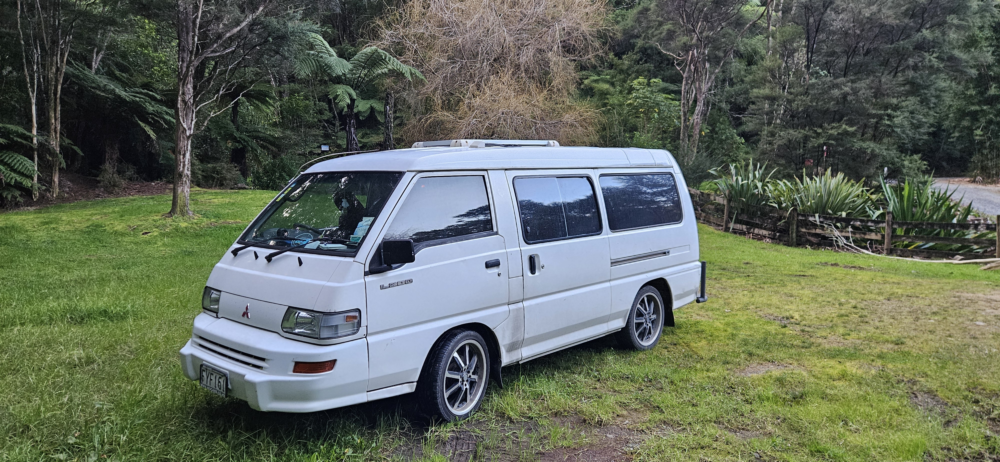
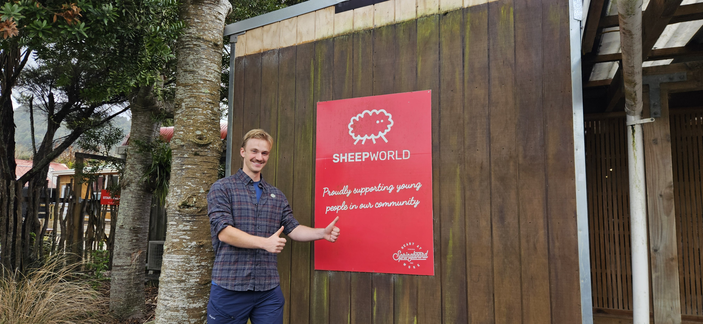
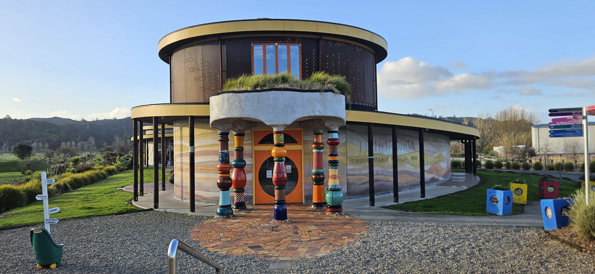
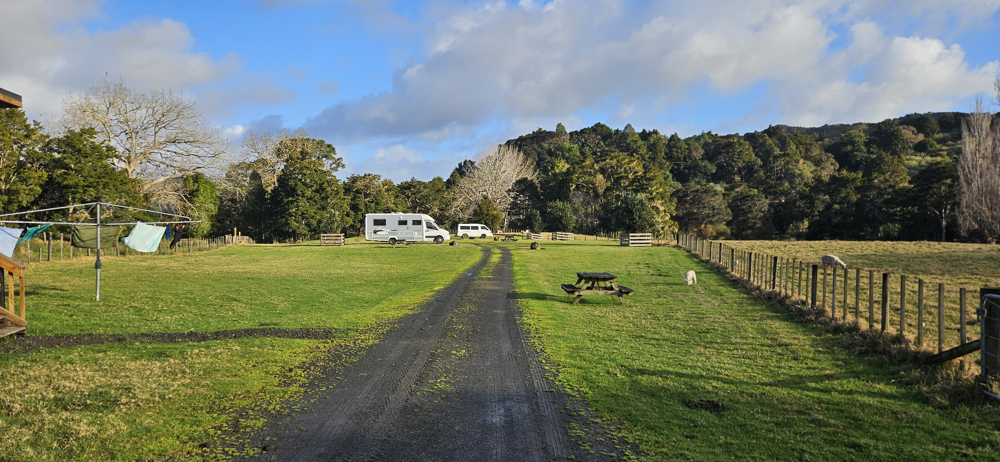
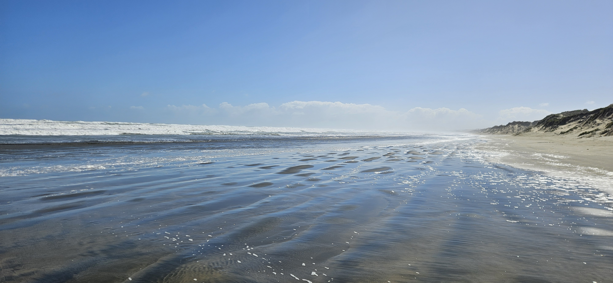
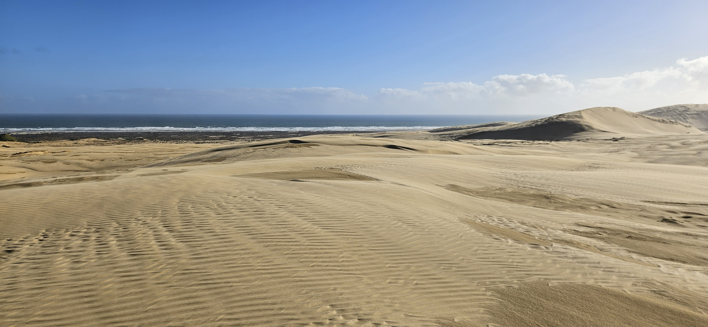
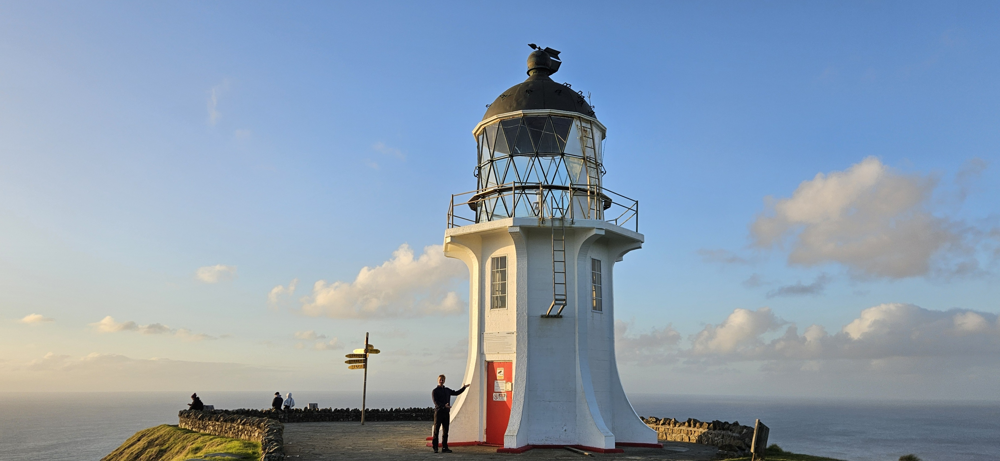
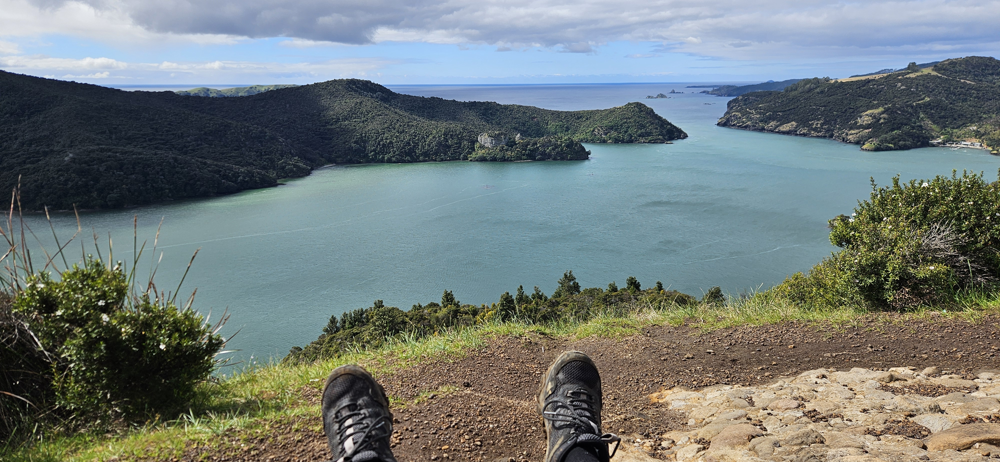
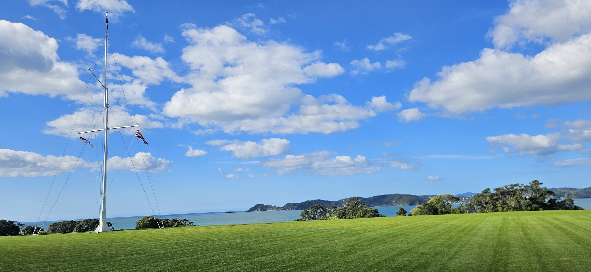

# Mid-semester break innlegg 1

**Disclaimer**: Jeg skrev dette på mobilen, og måtte krangle en del med GitHub. jeg beklager hvis noen av bildene ikke funker

Etter tre tunge akademiske uker var det deilig å vite at jeg hadde to uker med fri foran meg. Planen var å bomse rundt på egenhånd i to uker, men to trivelige tyskere syntes det var hårreisende og spurte om jeg ville bli med i vanen deres i stedet. De er fra Marburg, kjent for sitt vakre slott, og Chemnitz, som var europeisk kulturhovedstad i 2025. List over andre byer som har vært europeisk kulturhovedstad inkluderer Kaunas, Litauen og Novi Sad, Serbia. Så denne tittelen henger høyt.

De har kalt vanen "Vandalf". Jeg skjønner ikke helt hva det betyr, men jeg lurer på om det kanskje er tysk. *Vandalf* er en vakker Mitsubishi L300. Dessverre er den bare forsikret for to personer så jeg får ikke lov til å prøve å temme udyret.

Her er en kort oppsummering av hva de siste dagene har gått til, fortalt ved hjelp av formatet sammensatt tekst.

## Mandag 2026-08-31

Turen startet nordover fra Auckland. Litt bord for byen besøkte vi Sheep World. Dette har vært på listen lenge og jeg var veldig glad for å endelig kunne dra. For første gang en aktivitet som virkelig passer med bloggens tema

Av en eller annen grunn har den tyske arkitekten Hundertwasser designet et toalett i en bitte liten by i New Zealand som heter Kawakawa. Det var veldig viktig for tyskerne å besøke denne, så det gjorde vi selvfølgelig. 

Vi besøkte vår første av det som kommer til å bli mange campingplasser. Den så ut som dette da det var opphold, noe som ikke varte spesielt lenge. Store g skrudde på kranen ganske kort tid etter dette bildet, noe som ikke var spesielt trivelig.

## Tirsdag 2026-09-01

Vi kjørte til "90 Mile Beach", en veeeldig lang strand. Den er i virkeligheten bare 55 miles, som ikke engang er 90 kilometer, så her var det løgn etter løgn. Jeg mistenker det er en slags Grønland-situasjon, men da kunne de like godt kalt den 100 Mile Beach. Tenker jeg hvertfall. 90 Mile Beach er klassifisert som en "State Highway", og det er fullt mulig å kjøre på den hvis du har firehjulstrekk og det ikke er høyvann. Vi hadde ingen av delene, så vi tok beina fatt i stedet. Floen har tatt veldig mange biler, og det er mange kule bilder av biler og busser som står i vannet. Antakelig ikke like kult å være eier eller sjåfør da.

Helt nord på 90 miles, men ikke helt-stranden finner vi "Great Sand Dunes". Og de var sannelig store. Det var som å gå opp et lite fjell. Det føltes også litt som å gå i fjellet i Norge om vinteren, siden det blåste masse og alt var samme farge. Ingen av bildene vi tok klarte å fange hvor store disse sanddynene faktisk var, så dette bildet som bare ser ut som det er langt unna stranden og ikke kjempehøyt over havet.

Til slutt besøkte vi New Zealands Lindesnes, altså deres nordligste punkt. Det heter Cape Rainga og de har ikke spesielt overraskende bygget et fyrtårn her. I horisonten på bildet under skal det angivelig være en landmasse. Legenden sier at for 1200 år siden svømte en Maori-høvding til denne øyen. Modig eller dum? Imponerende uansett.

## Onsdag 2026-09-02

Vi gikk en tur til "Duke's Nose". Dette var angivelig en veldig tung tur, men den var helt greit altså. Mot slutten måtte vi klatre opp en liten skrent, det var jo kanskje litt krevende. Og så var utsikten veldig fin på toppen

Tyskerne har også begynt å lære seg litt norsk, hovedsakelig fordi de repeterer det jeg pleier å si. Til nå kan de si  "Du vet aldri når du får bruk for et jernrør", "Bra ingen fikk den feite kua i huet", "Hva med deg sjæl" og "Din lille støgge dverg". Alle veldig viktige setninger.

## Torsdag 2026-09-03

I dag besøkte vi "Waitangi Treaty Grounds" stedet der britene og maoriene 6. februar 1940 underskrev avtalen om å leve sammen i fred og forsoning på New Zealand, underlagt det britiske imperiet selvsagt. Avtalen fantes i to versjoner, en på maori og en på engelsk. Den på maori var ganske gunstig for maoriene, og den de fikk servert og skrev under på. Men britene hadde størst kjepp og  svært tøyelig moral, og håndhevet i stedet avtalen som var skrevet på engelsk. Denne var ganske ugunstig for maoriene, og kulturen deres ble nesten utryddet som konsekvens av britenes regler. Avtalen ble underskrevet på denne plenen:

Flere innlegg kommer, så hold fast

