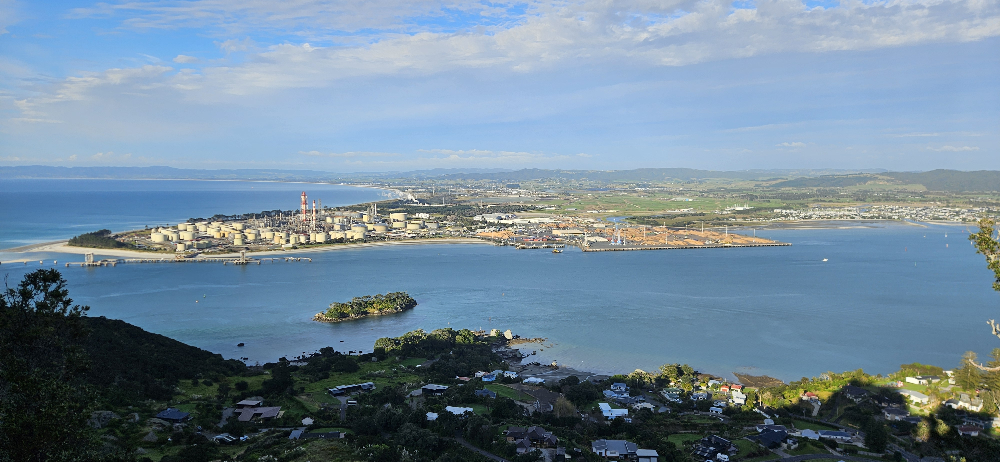
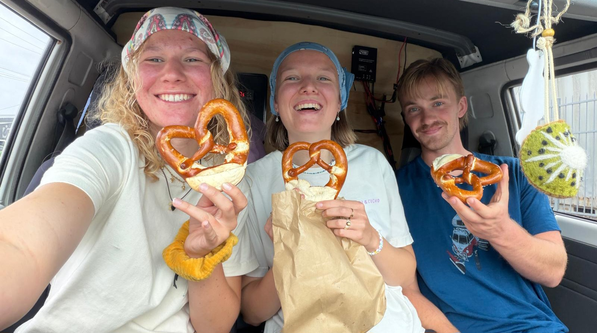
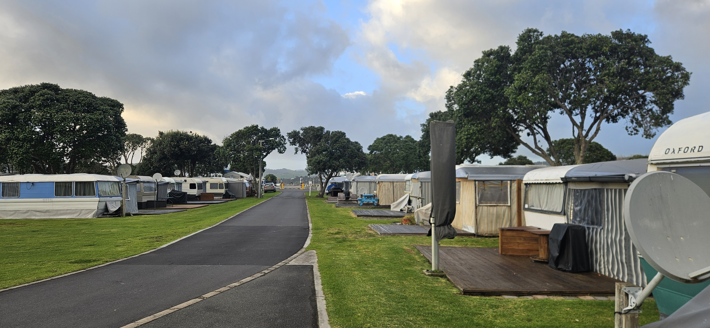
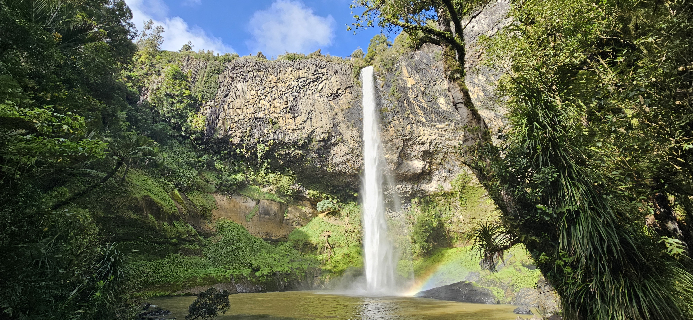
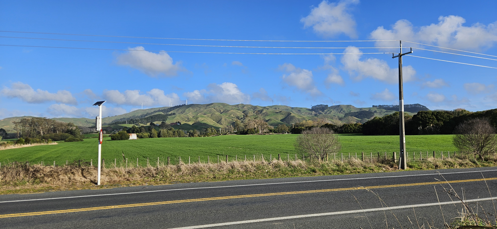
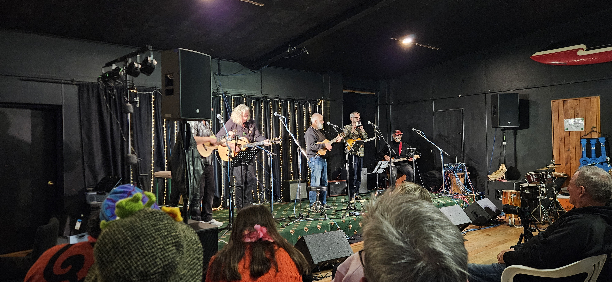
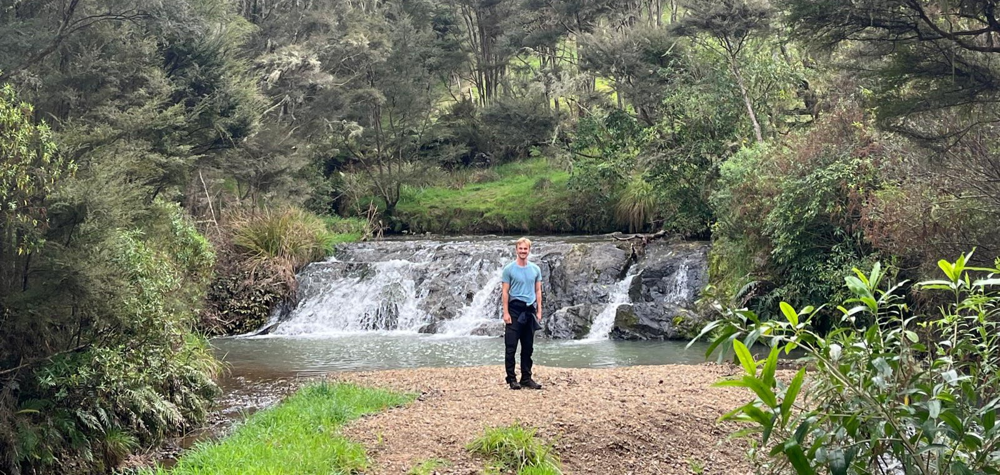

# Mid-semester break innlegg 2

Her er neste innlegg fra mid-semester break. Forhåpentligvis er jeg litt bedre på rettskriving denne gangen. 

Denne ferien har vist seg å være en ekte tysk opplevelse, noe jeg har kjent mye på de siste dagene.

## Fredag 2026-09-04

Vi startet dagen med å gå en liten tur for å skue utover det lokale oljeraffineriet. Da var tyskerne fornøyde. Selv om de ikke har så veldig mange oljeraffinerier i Tyskland (ingen fotnote på den påstanden), og dette dermed ikke var *helt* som hjemme, var det likevel fint for dem å døyve industriabstinensense litt. 

Resten av dagen var mye reise. Men vi gjorde et obligatorisk stopp innom et tysk bakeri. Haha kan ikke du bestille på tysk da, Anders?? Det blir kjempegøy. Snakk om humor på andres bekostning. Jeg (vi) kjøpte brød og brezel. På en eller annen måte

Dagen ble avsluttet på campingplass, nok en trygg havn for tyskern. Jeg skjønner egentlig litt hvorfor de liker det, for det var egentlig ganske alright. Kanskje fordi det var offseason og veldig få folk der. Men det er bare en hypotese da.

## Lørdag 2026-09-05

I dag ville vi egentlig surfe, siden vi hadde reist til en slags surfeby var det en passende aktivitet. Men surfekisen i surfebutikken sa at surfebølgene kanskje muligens var litt store for nybegynnere. Så da ble det ikke noe wapow rip curl brother i dag. Vi prøvde å leie kajakker som en alternativ aktivitet, men kajakutleiestedet var stengt for vinteren. Ikke noe vannsport i dag. I stedet ble det en rolig dag i solen, så en tur til en stor foss. Kul foss. Den var stor.

Vi så også vindmøller. Tyskere elsker som kjent vindmøllene sine. Ingen som ville slåss heller

Uten at vi hadde fått det med oss hadde det vært Ukulelefestival i Raglan i dag. Heldigvis fikk vi med oss at de skulle være konsert på kvelden. Her er et bilde fra den konserten:

Legg merke til at alle på scenen er en smule gamle. Det samme gjaldt publikum, vi trakk definitivt snittet ned, og det med ganske mye. Likevel skulle det verken stå på ferdigheter på scenen eller stemning i salen. Jeg tror aldri jeg har sett så kule bestefedre, og gleder meg allerede til bingoklubb om 50 år.

I tillegg til bestefedrene var det også en ukulelegruppe med 13 tanter, og en kis med verdens eneste barriton-ukulele. Så pm noen vil bli med på Raglan Blues & Country Festival 23-26 oktober og se gjengen igjen, så er det bare å si ifra. Jeg skal.

Setlist for bestefedrene, som hvertfall jeg syntes var veldig bra.
- King of Convenience - *Boat Behind*
- Commodores - *Easy*
- David Byrne - *Like Humans Do*
- Supertramp - *Goodbye Stranger*
- Dave Dobbyn - *Whaling*

## Søndag 2026-09-06

Egentlig ikke noe særlig spesielt som skjedde i dag. Jeg har ikke noen gode vitser heller. Vi kjørte litt bil og så denne fossvarianten 

God natt, bloggen. Ses senere
