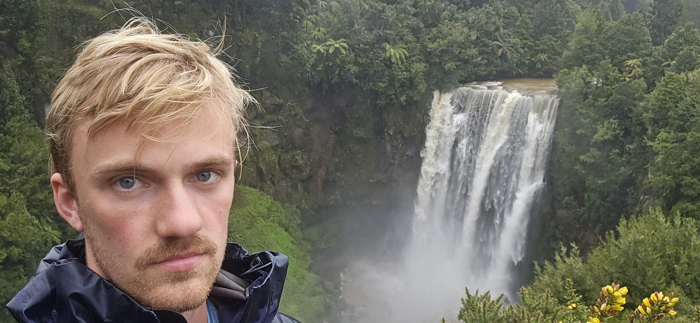
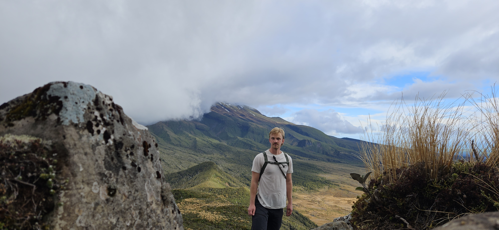
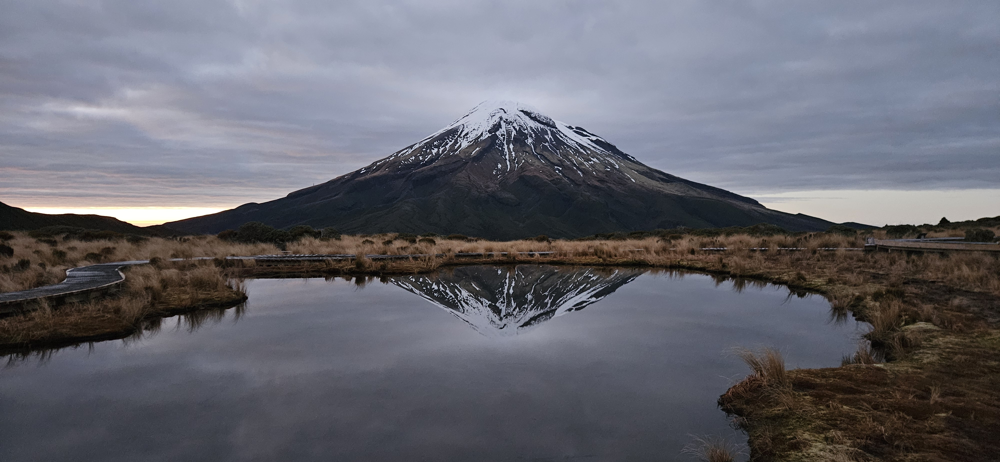
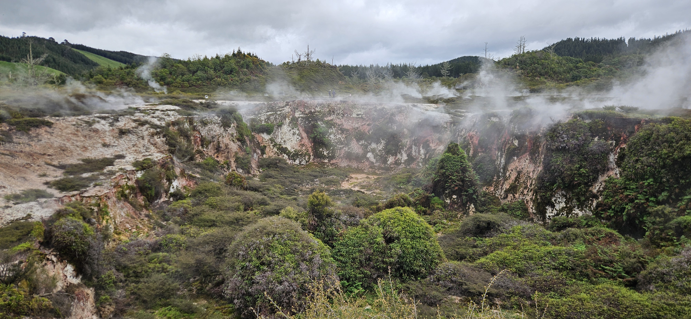
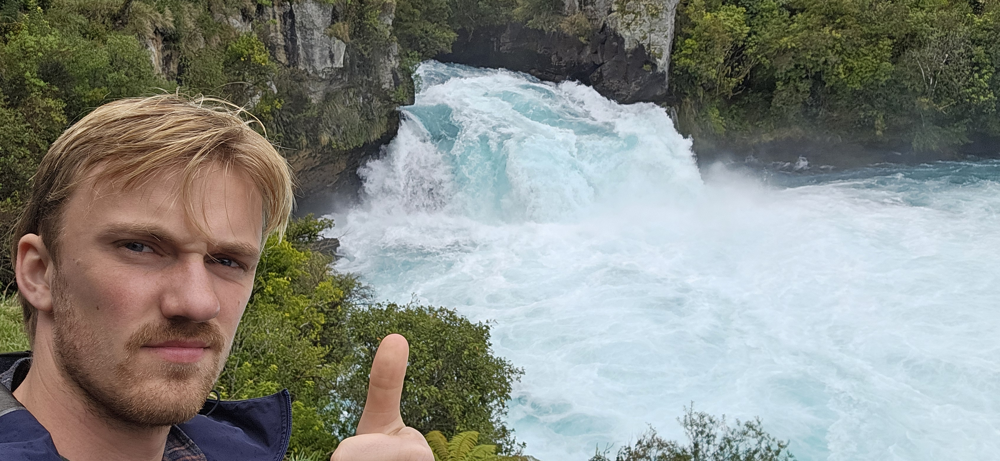
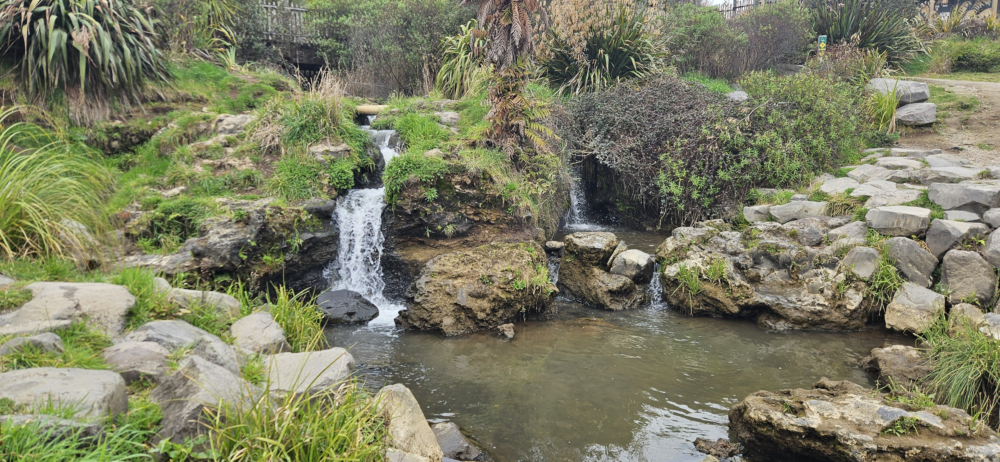

# Mid-semester break post 3

I have concluded that it is quite time consuming to add photos to the posts when I only have my phone, so this post will probably have fewer pictures than the last, but I will compensate with more text (yay). Hopefully you (the reader) think that is fint, and if you don't, it is voluntary to read on.

## Monday 2026-09-07

We looked at a big waterfall today. It's name is Omaru.

During the rest of the day, there were unpractical amounts of rain, so we sought refuge at a climbing gym in New Plymouth. I have no pictures from there, but I can say that New Plymouth got its name from the English settlers that migrated there, surprisingly enough from Plymouth in England. Plymouth was so good they had to travel around the entire world to make Plymouth 2. 

## Tuesday 2026-09-08

Today we parked at the foot of Mt Taranaki and walked to a hut in the hillside on the way up to the top. Mt Taranaki is an inactive volcano and the summit was ascended for the first time by a whaler in 1839. He wasn't first because the Maori lacked to ability, but becuase they considered the mountain holy, so that they were not allowed to get to the summit.

I tried taking a picture of myself and the mountain with a timer, and that went amazingly.

We slept at the hut so we could see the mountain in the sunset the morning after.

## Wednesday 2026-09-09

The sky cover wasn't perfect, an inconvenient cloud was in the way of the sun. But I still snapped this photo, which wasn't too bad.

The rest of the day was mainly administrative. We walked down to the car, drove on a road and slept on a campsite. One of the roads we drive was called "The Forgotten Highway". Exciting name. It was so forgotten that there was construction work every second kilometer. Along this well maintained forgotten road lays *The Republic of Whangamomona*, which after some conflict over administrative borders declared their independence in 1989. Internationally recognized New Zealand obviously thought this was a fun local initiative and continued collecting taxes from the inhabitants. The "Republic" holds a biannual election to elect the president. Former presidents inklude a poodle and a goat. The current president is a dude though

## Thursday 2026-09-10

We visited *Craters of the Moon*. They had signs with claims like "astronaut would have loved this place since it looks like the moon", and "I found life on the moon, and it turns out most of it were tourists". I am critical towards the first one, and didn't really understand the last one. 

Above is a picture of the so-called moon landscape. I cannot speak for everyone elses education systems, but at Eikeli elementary school I at least learned that the moon does not have any plants on it. But what do I know. Or the teachers for that matter. Neither of us have been there.

Afterwards we looked at a big waterfall. It is called Huka. We wondered why the water was so blue, and read on a sign that it is because there are a lot of air bubbles in the water. Did not get any wiser.

We wrapped up at a so-called "hot spring", which a German reviewer in typical German fashion described as "ein lauwarmes Schlammtopf", a luke warm puddle. The puddle part was a bit strict, but the luke-warm part was very precise. But I get that's what you get for 0 dollars.

