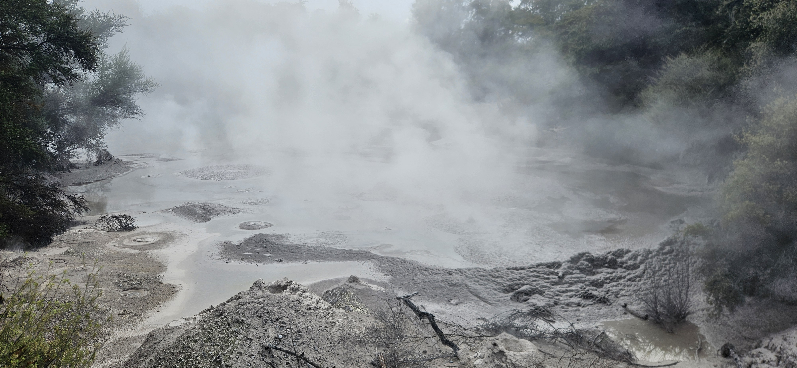
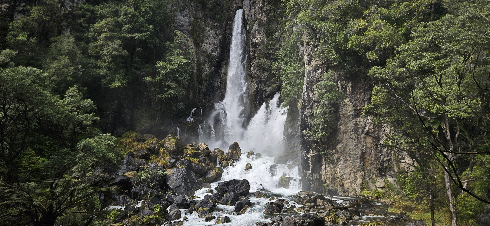
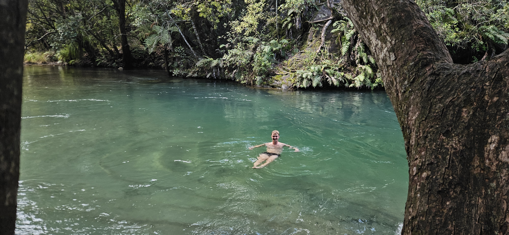
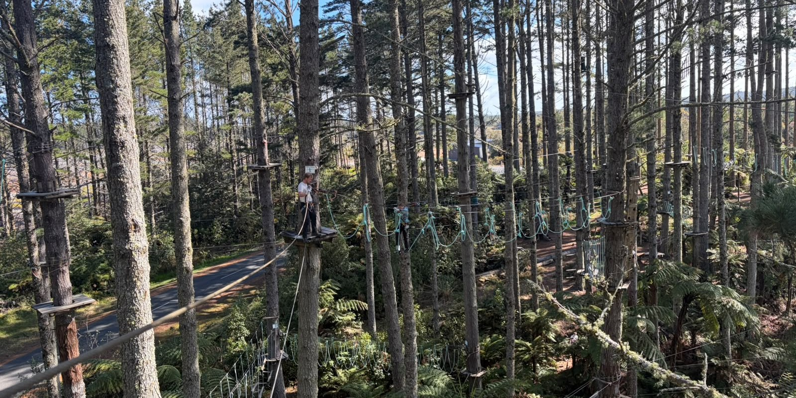

# Mid-semester break innlegg 4

Her er de siste dagene av mid-semester break. På grunn av lav motivasjon blir dette kort og med få bilder. Jeg tar ikke kritkk.

## Fredag 2026-09-11

Dagens første turist"attraksjon" var en rykende dam med sur gjørme. Dette stedet heter "Waiotapu Mud Pool", og det er egentlig litt kult at naturen gjør det. Men det kjemmet ikke akkurat det proverbiale håret.

Etterpå gikk vi en tur til en *veldig* stor foss. Den heter Tarawera. Veien til parkeringsplassen for å gå turen til denne fossen går gjennom en privat skog, men eierne har vært *så* snille og tillater ferdsel gjennom skogen i helger hvis du møter opp i billettluken og betaler 10 kiwidollar. Men vi så *dessverre* ikke skiltet som sa det før vi kjørte vekk derfra igjen. Ups. Jeg tviler på at det New Zealandske polititet overvåker denne bloggen, så da går det greit å innrømme dette grove lovbruddet. Moralen i denne historien er at det er greit å stjele hvis du ikke blir tatt. Fossen var kul da, så det var verdt det.

På vei ned badet vi i elven. Dette bildet gjenspeiler på ingen måte hvor fint dette stedet var. Jeg velger å skylde på fotografen og ikke motivet. 

## Lørdag 2026-09-12

I dag var vi i klatrepark. Heldig med været også. NSTR på resten av dagen egentlig. 

## Søndag 2026-09-13

Vi kjørte tilbake til Auckland. I morgen begynner hverdagen igjen. Yay