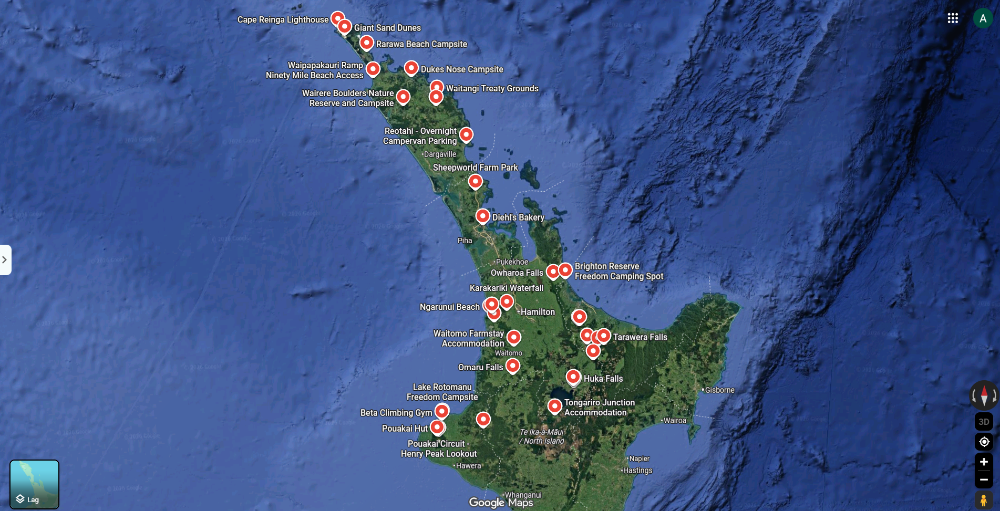

# Mid-semester break innlegg 5 - oppsummering

Her er en liten oppsummering av turen jeg tok under mid-semester break. 

- Antall kilometer tilbakelagt (anslag): 2440  
- Antall timer i bil (anslag): 37  
- Kilometer i timen (snitt) (anslag): 66 

Kan si her og nå at den bilen ikke snittet på 66 kilometer i timen. Jeg tror google maps antar litt mer enn 40 km/t i oppoverbakkene. 

Her er alle stedene vi besøkte på reisen. Det er jo ganske mange, men det er også tydelig at det er en del av denne øyen jeg ikke har sett noe av enda. Og det er dessuten enda en stor øy i dette landet, litt lenger sør. Så kan virke som jeg ikke er ferdig enda. 

- Høydepunkt: Sheep world
- Beste middag: Pasta i rød saus
- Største antiklimaks: Lunken pytt
- Største overraskelse: Ukulelefestival

<!-- 
| Dag | km | t | min | minutter | timer |
| :--- | ---: | ---: | ---: | ---: | ---: |
| 31.aug | 275 | 3 | 46 | 226 | 3,77 |
| 01.sep | 256 | 3 | 58 | 238 | 3,97 |
| 02.sep | 106 | 1 | 30 | 90 | 1,50 |
| 03.sep | 163 | 2 | 35 | 155 | 2,58 |
| 04.sep | 346 | 4 | 59 | 299 | 4,98 |
| 05.sep | 43 | 0 | 49 | 49 | 0,82 |
| 06.sep | 111 | 1 | 46 | 106 | 1,77 |
| 07.sep | 224 | 3 | 10 | 190 | 3,17 |
| 08.sep | 59 | 0 | 55 | 55 | 0,92 |
| 09.sep | 234 | 3 | 50 | 230 | 3,83 |
| 10.sep | 196 | 2 | 48 | 168 | 2,80 |
| 11.sep | 189 | 3 | 16 | 196 | 3,27 |
| 12.sep | 84 | 1 | 20 | 80 | 1,33 |
| 13.sep | 154 | 2 | 17 | 137 | 2,28 |
| **Total** | **2440** | | | | **36,98** |

km/dag: 174 km
km/timen (aktiv kjøring): 66 km/t -->