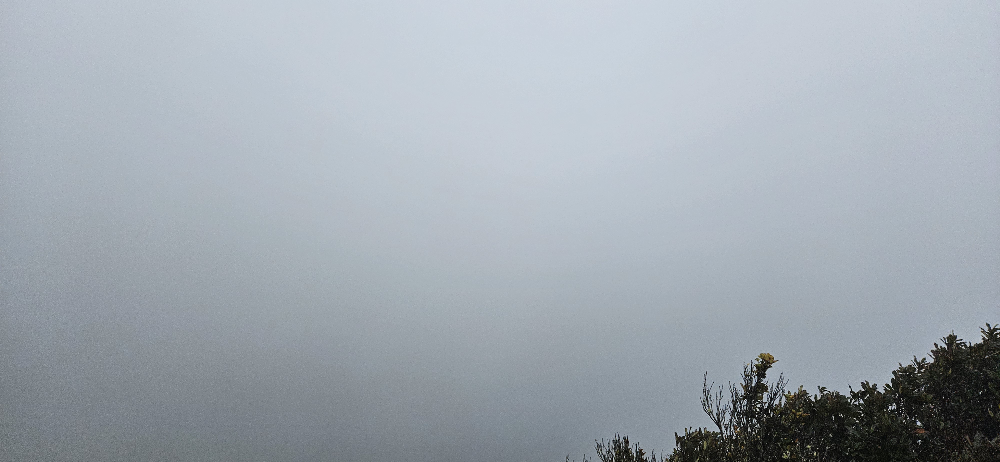
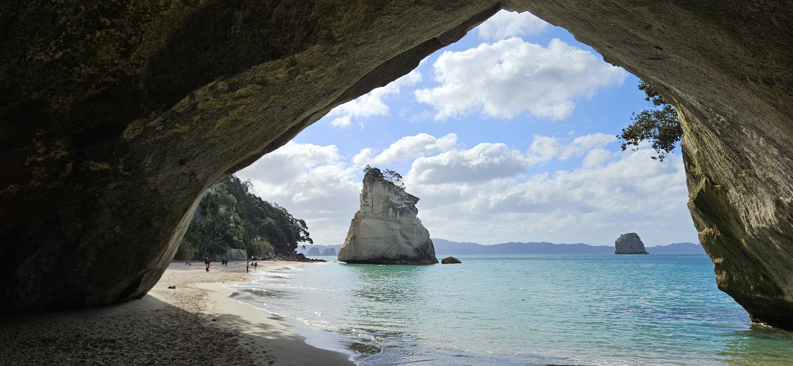
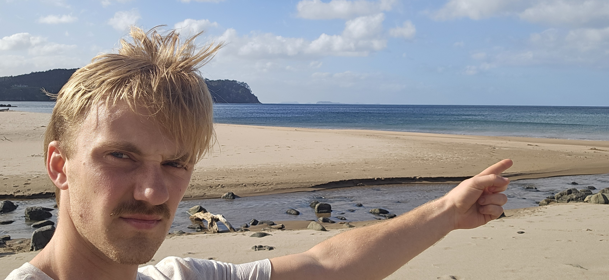

# Trip to The Pinnacles

This weekend I travelled to the Pinnacles. This is a mountain a two short hours drive from Auckland. Then some walking. At the top there is a hut where we were going to spend the night. Below are some reviews of this place:
- "*The views from the pinnacles are some of the best views I’ve seen in New Zealand.*"
- "*Great hike with incredible views.*"
- "*The trail takes you through beautiful forest, across swing bridges, and up to incredible panoramic views at the summit.*"

Wow, this can't be anything than good. And check out that view from the top!!!

The hut was fully booked before we left, so we assumed we would meet 76 other happy trampers in approximately the same age segment as us. We were not prepared for the eventuality that approximately all 9, 10 and 11 year olds in all of New Zealand would be up here. We're talking 40 rabid children running around and screaming and shouting and mindlessly hammering on every random object the can find. I think these kids are too used to their iPads, and subsequently don't know how to control themselves when they suddenly have lots of energy. And that is actually fine by me. During the day. But when they start playing "who can be the loudesy ghost in the sleeping area" a quarter past six Sunday morning, even I get slightly annoyed. This trip has changed me. I am now pro-iPad in schools, at home, the cabin, vacation and the car. Please give those kids some Subway Surf, so they can finally be quiet.

On Sunday we went to Cathedral Cove. It looks like the windows screensaver, but sadly isn't. Instead it is the place where they shot parts of Narnia 2. And it was a little cool and pretty here. 

Next stop was a place called "Hot Water beach". I felt the water and it was disappointingly cold. Cold Water beach if you ask me. Below is a picture of me pointing at where this cold beach is. 

