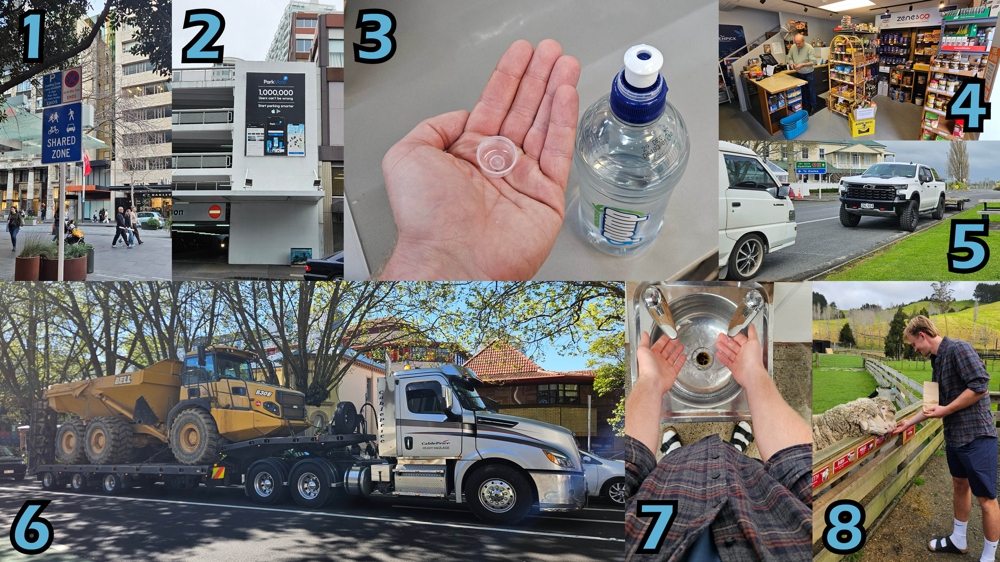

# Noen utvalgte bilder

Det er dessverre ikke alt som blir til sitt eget blogginnlegg. Så under er noen bilder som kanskje ellers ikke hadde fått så mye oppmerksomhet

- **1**: Det er så nære. Bare gjør det. Fjern bilen. Gjør sentrum til et hyggelig sted for fotgjengere. Jeg vet dere greier. 
- **2**: Nei, og 40 millioner tyskere kan ikke ta feil heller. Det hadde tatt seg ut.
- **3**: Hva skal jeg liksom med denne? Holde den i hånden? Det gidder jeg jo ikke. Da går den på bakken da, så kan en fugl eller et barn sette den i halsen i stedet
- **4**: Dette er en tysk matbutikk. Her selger de ikke knödel eller brezel, men de selger Capri-Sonne
- **5**: Se på denne nødvendig store bilen
- **6**: Om dette er det kuleste jeg noengang har sett? Ja. Får ikke lastebil med hjullaster i Oslo sentrum
- **7**: Er det egentlig noen i hele verden som foretrekker det her? Yes, nå har en skitten, varm hånd, og en skitten, kald hånd. Jammen bra. Av alle ting de kunne adoptert fra britene velger de akkurat dette. Kunne de ikke valgt noe bra i stedet, menn med parykk for eksempel
- **8**: Meg som mater sau i kontrollerte former