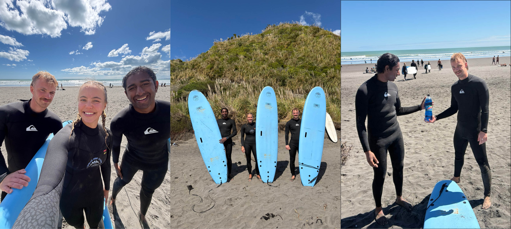

# Bevis på at jeg har venner

Forrige gang jeg snakket med mor spurte hun meg om jeg hadde fått noen venner da. Til det svarte jeg ja, mamma, jeg har det. Jeg merket at andre enden ikke var helt overbevist, så her er beviset. 

Denne helgen dro jeg til Raglan for å surfe. Jeg har vært i Raglan tidligere, men da var det for kule bølger for oss. Denne gangen var bølgene heldigvis greiere mot nybegnnere. Jeg kjørte sammen med Sanna og Juvan. Sanna er fra Sola (ikke Stavanger) og Juvan er fra Narvik (hvertfall ikke Harstad). 

Forrige gang jeg prøvde å surfe meldte jeg at det var gøy, men at jeg gjerne skulle greid å stå litt mer på brettet i stedet for å bare falle av. Denne gangen klarte jeg å stå litt mer, og det var mye morsommere. Så det er tips til dere som aldri har surfet før, men har planer om å prøve. 

Vi smakstestet også en spylervæskefarget brus. Den smakte like naturlig som den ser ut. Hadde kanskje gjort seg som blandevann til [Små Sure Sour Shot Bubble Fizz](https://www.vinmonopolet.no/Land/Danmark/Sm%C3%A5-Sure-Sour-Shot-Bubble-Fizz/p/7271102).
