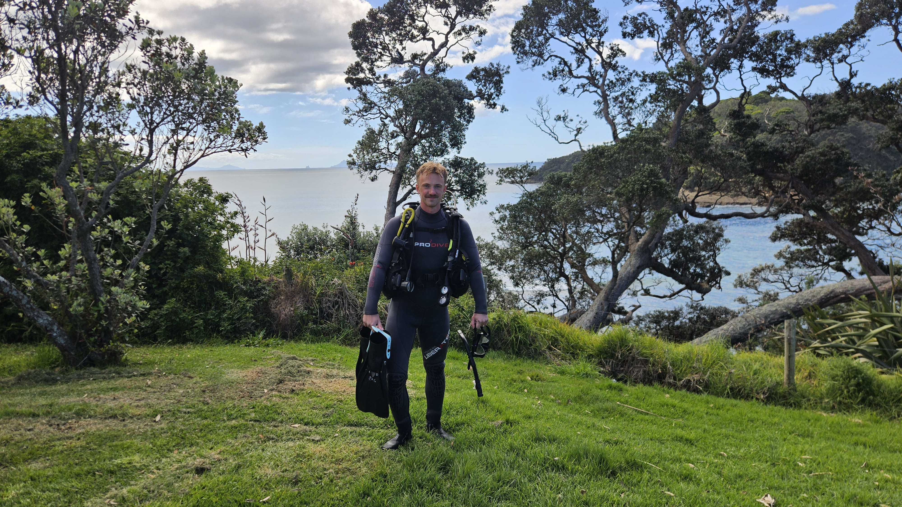

# 4 dager hos Auckland Scuba

Plutselig var min tid hos [Auckland Scuba](https://www.aucklandscubadive.co.nz/) forbi. 🌊

4 dager.

12 meter.

Ingen rom for feil.

Denne uken har jeg vært så heldig å få delta på kurs hos [Auckland Scuba](https://www.aucklandscubadive.co.nz/) for å bli sertifisert som PADI® Open Water Diver. 🤿🐟

Jeg har lært utrolig mye over de siste fire dagene og står igjen med verdifull erfaring i hvordan overleve på steder jeg ikke visste det var mulig.

I løpet av kurset har jeg virkelig lært hvor viktig det er å holde seg rolig under stressende situasjoner i ekstreme miljøer, erfaring jeg vet jeg kommer til å bære med meg for resten av livet.

Jeg er nå dypt ydmyk og utrolig stolt over å kalle meg selv sertifisert PADI® Open Water Diver. 🌟

En stor takk til alle i [Auckland Scuba](https://www.aucklandscubadive.co.nz/) for å gjøre denne uken så bra, og for å gi meg denne fantastiske muligheten! 🙌🏼🦈

#PADI#Dykking#Mindset#Hydrodynamikk#OpenToWork

# Inspirasjon 1
8 weeks at DeepOcean ! 🌊

And just like that, my 8-week internship at DeepOcean has come to an end! 

I’ve learned so much over these past weeks and had the chance to meet so many great people along the way!

During my internship, I’ve had the opportunity to work on my own HR project, gain insight into how HR works in practice, represent DeepOcean at Yrkesmessa in Tysvær for two days, visit Edda Fauna, and much more!

Now it’s time to head back to BI, finish my remaining courses, and get ready to write my master’s thesis next spring. 🎓

A big thank you to everyone at DeepOcean for making these eight weeks so great and for giving me this opportunity! 💙

# Inspirasjon 2
I’m proud to share that I recently participated on ECSL - European Centre for Space Law and European Space Agency - ESAs renowned summer course in Space Law and Space Policy in Ljubljana, Slovenia, together with selected students and young professionals from all over Europe!🚀⚖️

Two weeks of interesting lectures, a challenging group project, excursions and hard work has paid off, and I’m left with valuable insights in the highly relevant intersection between the growing space sector and international law. And of course - lots of new friends and acquaintances!

Thank you for the opportunity, ECSL - European Centre for Space Law and European Space Agency - ESA, and for hosting - Faculty of Law, University of Ljubljana!

# Inspirasjon 3
I helgen var jeg så heldig å få delta som finalist i Labyrinten hos Bekk, etter at laget mitt OverBekkEtterVann vant kvalifiseringsrunden i Bergen tidligere i år.

Sammen med Sigurd Berg, Jens Andreassen og Ludvik Alvegg-Langhelle klarte vi faktisk å dra seieren i land også!! 🤩🤩

Finalen ga oss muligheten til å besøke Bekks lokaler og konkurrere mot dyktige studenter fra NTNU Trondheim, Universitetet i Oslo og medstudenter fra Universitet i Bergen.

Vil virkelig takke Bekk for en sykt stas og lærerik helg, med masse nye erfaringer innenfor konsulenttilværelsen. Vi fikk også bidra i utviklingen av et reelt prosjekt for en av Bekks kunder, noe som gjorde opplevelsen ekstra spennende og relevant.

Alt i alt en skikkelig bra helg, både faglig og sosialt! 🙌