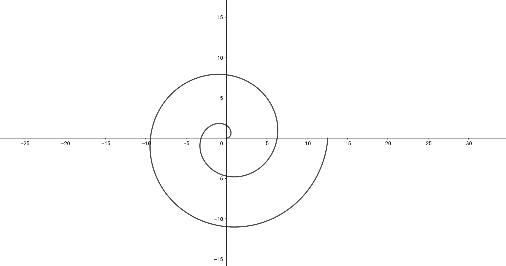
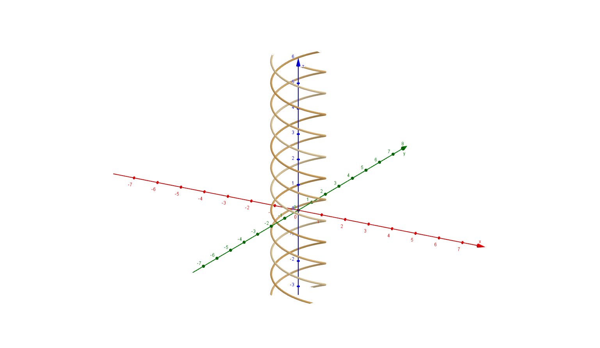
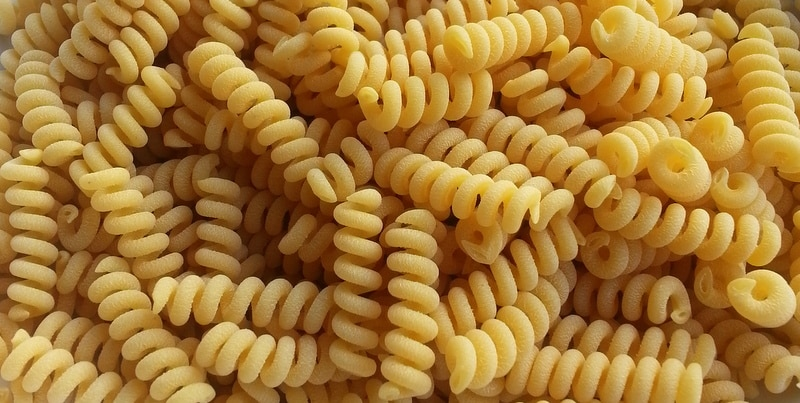

# Amerikanske tilstander i pastahyllen

Jeg vet ikke hvordan pastahyllen ser ut i en amerikansk matbutikk, men basert på mine fordommer mot det landet vil jeg gjette at den ser omtrent ut som dette.

Jeg tviler på at det er noe annerledes i England, men jeg hadde jo håpet et New Zealand ikke skulle synke så dypt at de må kalle Fusilli for SPIRALS. Det er et elendig navn. Først og fremst er det ikke en spiral. En spiral er definert som $x=r(\theta)\cos(\theta),\ y=r(\theta)\sin(\theta)$ og ser ut som dette. 

Legg merke til at det er en **to-dimensjonal** form. Jeg ser hvertfall ikke noe tredje koordinat. Så hvilken del av en en fusilli som er to-dimensjonal skjønner jeg ikke. Åja, tverrsnittet, sier du. Det er jo ikke en spiral det heller!!!

Jeg kan *kanskje* (KANSKJE) akseptere at fusillien er en heliks, men det er vel ikke det som står på pakken heller, er det vel?? 

Det finnes til og med en pasta som er en heliks, som du i *verste* fall kunne kalt pasta spirals. Det heter *Fusilli Bucati Corti*, men for et land som åpenbart ikke husker noenting av den europeiske kulturarven sin, høres dette veldig vanskelig ut.

Bare kall fusillien for skruer, det er faktisk så enkelt. 

<!-- https://www.delallo.com/blog/pasta-shapes?srsltid=AfmBOopn5FIVzhkpHiv3Hv7GQA7b2ZQxxy30JL16DESLrnP2Hgo1ZpGT

Heliks i geogebra
Curve(sin(t), cos(t), t / s, t, 0, 10)
Curve(sin(t + 2π / 3), cos(t + 2π / 3), t / 2, t, 0, 10)
Curve(sin(t + 4π / 3), cos(t + 4π / 3), t / 2, t, 0, 10)
Denne kan gjøres med en liste også, sånn at det blir dynamisk hvor mange skruer

Spiral
Curve((θ; θ), θ, 0, 4π)
ekvivalent: Curve(cos(θ) θ, sin(θ) θ, θ, 0, 4π)

Curve((θ; θ + 2π / 3), θ, 0, 4π)
Curve((θ; θ + 4π / 3), θ, 0, 4π)

Faseskift:
ϕ=First(Sequence(0, 2π, 2π / n), n) -->