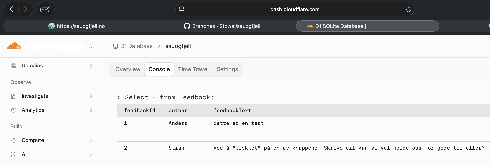

# Ikke si vi ikke lytter
## Litt om brukervennlighet
Vi har, som de gode utviklerne vi er, gitt dere lesere mulighet til å gi tilbakemeldinger. Selv om vi hadde idéen å sende alle tilbakemeldingene rett i `void`, så kom vi frem til at vi ville høre hva leserne våre mener. Faktisk lagrer vi tilbakemeldingene i en database som er mulig for meg å slå opp i, men det er her jeg har en liten tilbakemelding til meg selv...  

Fett å måtte skrive `SELECT * FROM Feedback;` for å kunne lese tilbakemeldinger, eller hva Stian? Jeg har til og med sagt til Anders at jeg skal lage et Admin-panel, men det kan jo alltids være cloudflare-dashboardet...

## Nå over til tilbakemeldingene
Nå har jeg sittet her på hytta og gjort SQL-queries en gang i blant, både for å se hvordan ELO rangeringen ligger an og for å lese litt tilbakemeldinger. Da kom jeg over et par gullkorn som jeg gjerne vil dele og det er meta nok til at det kan være en dev-update (jeg lover det informeres om en ny feature etter hvert).

### Mine favoritter
I og med at vi ikke har meddelt at vi kommer til på dele tilbakemeldingene så holder jeg dem anonyme:

**Dette er et gullkorn:**  
*må faen meg gå an å få til litt mer brukervennlighet når en skal stemme på hvilken sang er best??! burde vært en funksjon når man tar musepekeren over gitt sang, så bør sangen spilles av automatisk eller no. kanskje en link til et eller annet. dere gjør det vanskelig. håper dere ender opp rovaniemi*  
Jeg liker denne spesielt godt siden den både ønsker at Anders og jeg skal sendes i krig i Finland óg har et faktisk ønske om forbedring.

**Her kan det hates med litt sterkere skyts:**  
*Hat hat hat (anonym hatmelding)*  
Spesielt gøy er det her at vedkommende har oppgitt navn og så skrevet at det er en anonym tilbakemelding i parentes.

**Her meldes det passe hardt**  
*Dette er så nørd setting: "jeg endelig gjøre den mega-artige oppgaven å migrere feedback-databasen fra local til remote"*  
Jeg er enig

**Fint med litt ros***  
*Elsker toggle theme funksjonen. Veldig vakker*  
Vi ber jo om hat, men det er godt å vite at man har gjort noe riktig også

**Grunnen til at jeg skriver dette**  
*Vil gjerne kunne skippe en avstemning på elo*  
Noen skrev (anonymt) at de ønsket en funksjon for å skippe sang, til det sier jeg: *"watch me"*  
Det skal nå være mulig for dere, kjære lesere, å skippe over et sett med sanger om dere:
- Ikke har hørt noen av dem
- Ikke klarer å velge
- Hater begge nok til at dere ikke klare å si at den ene er bedre enn den andre

Til sist vil jeg bare oppfordre dere til å bruke den nye knappen med måte, fordi Anders og jeg trenger statistikken på hva dere synes er gode sanger og ikke. Og fortsett å sende tilbakemeldinger da.
