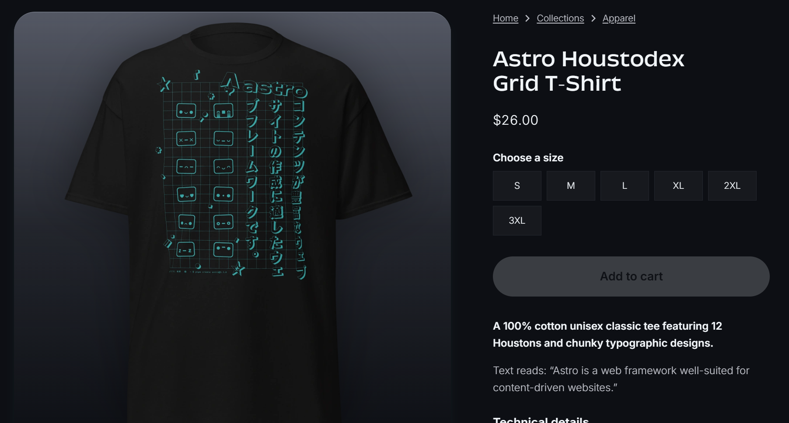

# Mer Markdown!

Blogposts kan nå ha enda mer markdown-formatering. 

Formler, det kommer alle til å elske

$$
\frac{d^4w}{dx^2}= \frac{q(x)}{EI}
$$

Kodeblokker og `inline kode`
```python
# Dette er en kodeblokk
for i in range(0, 10):
    print("Jeg elsker markdown")
```

> Såkalt block quote
> - Med liste inni. Kult

Bilder. På bildet under er det en veldig kul t-skjorte. Om noen har lyst til å kjøpe en sånn til Stian blir han veldig glad. Størrelse S helst. Hvertfall ikke L eller XL, da blir han veldig sint. Link:  https://shop.astro.build/products/houstodex-grid-t-shirt/

<!-- Måte 1 – inline HTML med fast bredde (bildet ligger i `public/`, ikke optimalisert av Astro):

 -->

<!-- Måte 2 – vanlig markdown-bilde (optimalisert av Astro, men uten størrelseskontroll): -->

