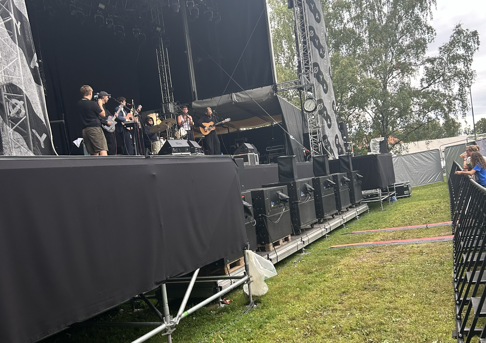
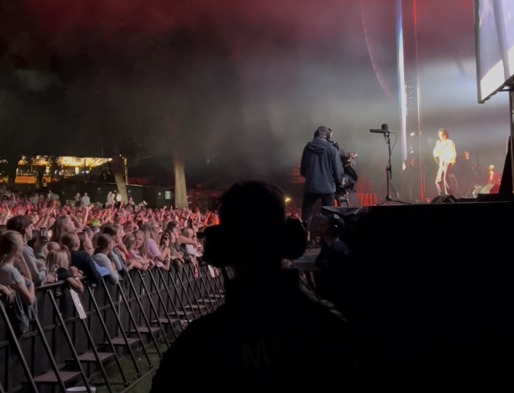

# G Øya lt
Jeg har vært scenevakt på Øya denne helgen. Hvem visste at man kunne få betalt hele 200kr timen for å få litt mer tinitus og bli lagt an på av 17-åringer óg 40-åringer?! 

## Hva er Øya?
Øya-festivalen er en musikkfestival, men musikken er ikke for alle. Det virket faktisk som at noe av musikken ikke var for noen.
Scenevakter gjør mest ingenting, spesiet når publikum er 40 år gamle og klokken er to på en onsdag.  
Det er bare noe med å stå inni subwooferen som har gjort at jeg har blitt godt kjent med arbeidet til Richter, på godt og vondt.

Uansett er det noe nydelig ironisk med å ha husets beste plasser og fortsatt ikke kunne se scenen.

## Var det noen nevneverdige artiser?
Det var mye indie, jazz og folk, og varianter av dem.  
De jeg likte best var ikke det da...
- Lambrini Girls var fett, de lagde (stor) moshpit
- Sombr tok meg med på løpetur gjennom hele publikum
- Dagny hadde pyro
- Gjenfødt kultur hadde Ravi på scenen

Publikum var enten barn eller voksne, her ser dere publikum under Sombr-konserten  

Jeg har ikke tatt så mange bilder fordi jeg generelt ikke tar så mange bilder.