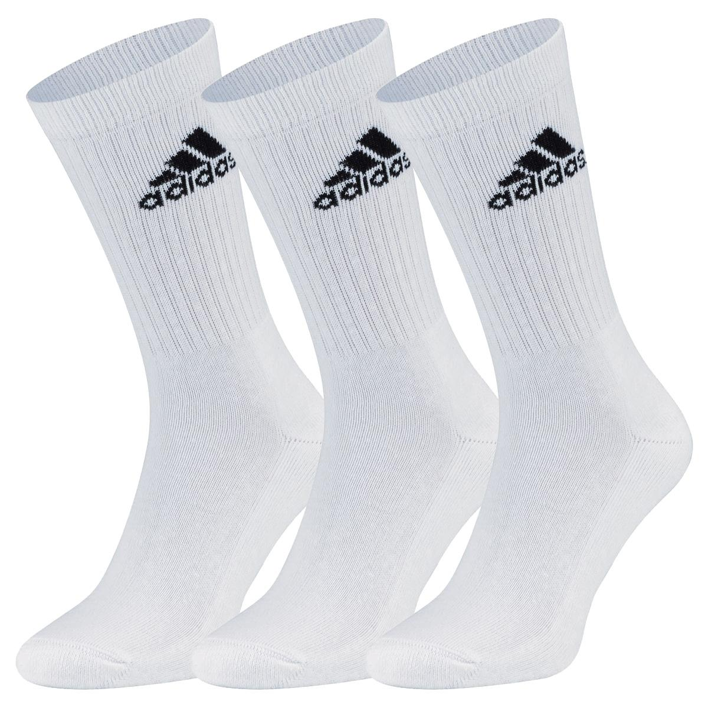

# Können ich uber etwas verarget gewesen?

## Die praksish
Meine Sockefilosogfie die letztes fünf jahre ist das ich soll nur ein Typ gekaufen, nämlich adidas Tennissocken. Weiße Socken am meistens, aber ich habe auch Schwarze Socken für feine anletnungen.

Das hier ist die socken:

Dieser ordnungen hat gut fungiert und ich hat nicht die Socken aufgepaaren mussen. Alle die sauberen Socken sind die samme und sie gehen in die Sockesublade. Wann ich gehe ins sportladen ich kaufe eine packung neue Socken.

## Das Verrat

Ich war im Sportladen vor ein paar Wochen, und ich will mehr Socken kaufen. Aber adidas hast die Sockedesign Geändert!

Ich muss neue socken kaufen...
