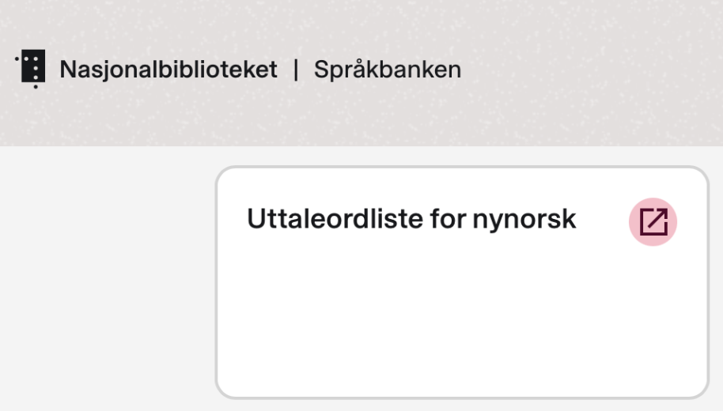

# Hæ

Jeg trodde hele poenget med nynorsk var at man skulle kunne uttale ting på egen dialekt 

[Nationalbiblioteket mener tydeligvis noe annet](https://www.nb.no/sprakbanken/uttaleordliste-for-nynorsk/)

Her klarer vi rett og slett å definere oss vekk, spør du meg. Nå har vi et skriftspråk som liksom skal "samle alle dialektene". Hvis vi så skal definere en riktig og gal måte å uttale det på etterpå så kunne vi like gjerne ha definert en fasit fra start av.

Riktignok er dette en ordliste for tekst-til-tale modeller som skal kunne lese opp nynorsk, men den kan vel like gjerne lese det opp på østlandsdialekt?  

Her vil jeg gjerne høre noen andres tanker
